# Canonical Query Architecture: Building Intelligent AI Systems

## Overview

This document explains the **canonical query pattern** - a structured approach to building AI systems that handle business data queries. This pattern is implemented in **Lab 6** (Classification MCP Server) and **Lab 7** (Multi-Workflow Agent).

---

## Three Architectural Approaches

### Approach 1: Agent-Only Architecture

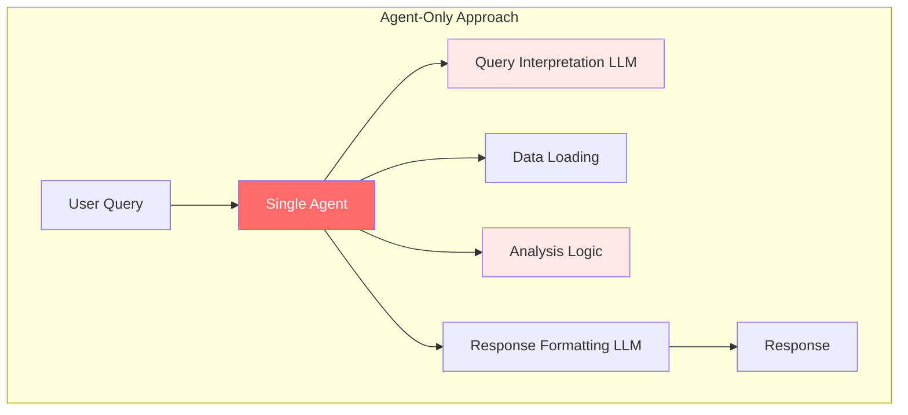

**Problems:**
- All logic embedded in one agent
- Code duplication across queries
- Tight coupling - hard to modify
- Difficult to scale

---

### Approach 2: Pure Data Tools

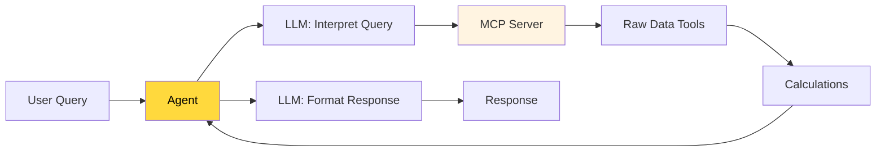

**Better, but:**
- Query interpretation still ad-hoc
- Each agent must figure out which tool to use
- No standardized query patterns

---

### Approach 3: Classification & Templates (Labs 6 & 7)

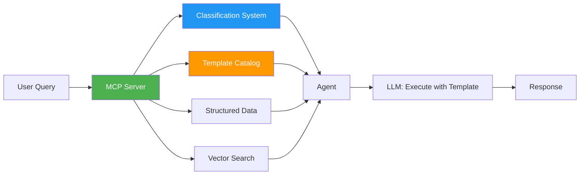

**Best approach:**
- Structured query interpretation
- Reusable templates
- Centralized query logic
- Server manages classification and data

---

## Lab 6: Classification MCP Server

### High-Level Architecture

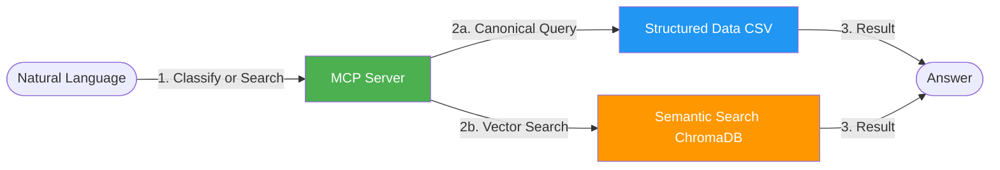

### Key Components

#### 1. Classification System (Keyword-Based)
- Maps natural language to canonical queries
- Uses keyword scoring and matching
- Returns confidence levels

#### 2. Canonical Query Catalog
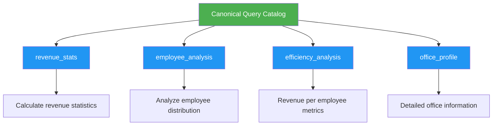

#### 3. Vector Database Layer
- **Two collections**: Locations (PDF) and Analytics (CSV)
- **Semantic search**: Finds relevant data beyond keywords
- **Fuzzy matching**: Handles variations like "HQ" vs "headquarters"

#### 4. MCP Tools Provided
1. `classify_canonical_query()` - Classify user intent
2. `get_query_template()` - Get prompt template
3. `get_filtered_office_data()` - Get structured CSV data
4. `vector_search_locations()` - Search PDF embeddings
5. `vector_search_analytics()` - Search CSV embeddings
6. `get_weather()` - Weather API
7. `geocode_location()` - Location to coordinates

---

## Lab 7: Multi-Workflow Routing Agent

### High-Level Architecture

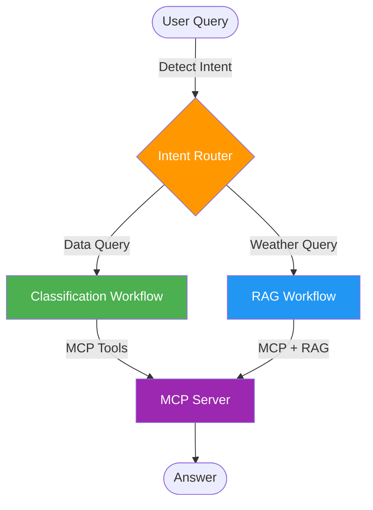

### Dual Workflow System

#### Workflow 1: Classification (Structured Data)

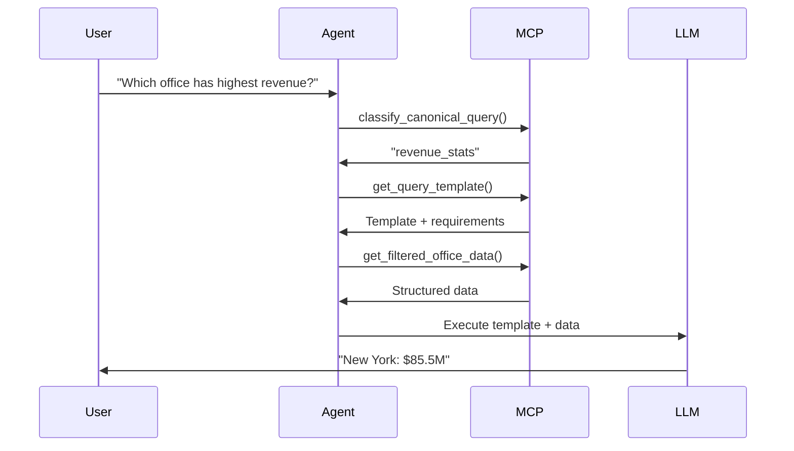

**Best for:**
- Structured business data (CSV/SQL)
- Predictable questions
- Numerical analysis
- Fast, accurate responses

---

#### Workflow 2: RAG (Unstructured Data)

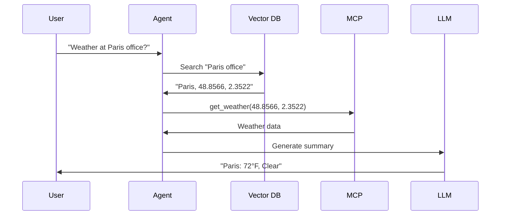

**Best for:**
- Unstructured documents
- Semantic search needs
- External API calls
- Open-ended queries

---

## Classification Workflow (Step-by-Step)

### Step 1: Natural Language Input

```
User Query: "What's our average revenue?"
```

### Step 2: Classification


**Server returns:**
```json
{
  "suggested_query": "revenue_stats",
  "confidence": 0.85,
  "alternatives": ["efficiency_analysis"]
}
```

### Step 3: Get Template

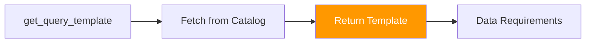

**Server returns:**
```json
{
  "template": "Analyze revenue data: {data}\n\nCalculate:\n1. Average\n2. Highest\n3. Total",
  "data_requirements": ["revenue_million", "city"]
}
```

### Step 4: Get Data


**Server returns:**
```json
{
  "data": [
    {"city": "New York", "revenue_million": 85.5},
    {"city": "Chicago", "revenue_million": 62.3}
  ],
  "count": 8
}
```

### Step 5: Execute LLM (Client-Side)

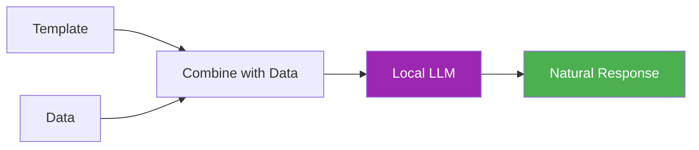

**LLM produces:**
```
Based on our office data:
- Average revenue: $68.4M
- Highest: New York at $85.5M
- Total revenue: $547.2M across 8 offices
```

---

## Comparison: Three Approaches

### Query Interpretation

| Approach | Method | Consistency | Scalability |
|----------|--------|-------------|-------------|
| Agent-Only | Ad-hoc LLM | ⚠️ Low | ❌ Poor |
| Pure Data Tools | Ad-hoc LLM | ⚠️ Medium | ⚠️ Medium |
| **Classification** | **Structured** | ✅ **High** | ✅ **Excellent** |

### Template Management

| Approach | Storage | Reusability | Versioning |
|----------|---------|-------------|------------|
| Agent-Only | Hardcoded | ❌ None | Manual |
| Pure Data Tools | Hardcoded | ❌ None | Manual |
| **Classification** | **Server** | ✅ **High** | ✅ **Centralized** |

### Development Experience

| Approach | Add New Query | Testing | Maintenance |
|----------|--------------|---------|-------------|
| Agent-Only | Modify agent code | Complex | Scattered |
| Pure Data Tools | Agent + Server changes | Medium | Split |
| **Classification** | **Server config only** | ✅ **Easy** | ✅ **Centralized** |

---

## Benefits of Classification Approach

### For Developers
- **Easy to extend**: Add queries via server config
- **Consistent patterns**: Templates ensure uniform behavior
- **Isolated testing**: Test classification, templates, and data separately
- **Version control**: All query logic in one place

### For Operations
- **Scalable**: One server serves multiple agents
- **Centralized monitoring**: Track query usage and performance
- **Easy updates**: Deploy new queries without changing agents
- **Consistent quality**: Same query interpretation everywhere

### For Users
- **Better accuracy**: Structured classification vs guessing
- **Predictable results**: Templates ensure consistent answers
- **Faster responses**: Pre-optimized queries
- **More capabilities**: Easy to add new analysis types

---

## Adding New Canonical Queries

### Server-Side Only (No Agent Changes!)

```python
# In MCP server configuration
CANONICAL_QUERIES["market_analysis"] = {
    "description": "Analyze market performance by region",
    "parameters": [
        {"name": "region", "type": "str", "required": True}
    ],
    "data_requirements": ["city", "state", "revenue_million", "employees"],
    "prompt_template": """
        Analyze market performance for {region}.

        Data: {data}

        Provide:
        1. Total revenue for region
        2. Number of offices
        3. Average office size
        4. Growth trends
    """,
    "example_queries": [
        "How is the West Coast performing?",
        "Show me East Coast market analysis",
        "Analyze Southern region performance"
    ]
}
```

**That's it!** The classification system automatically:
- Recognizes queries matching the examples
- Provides the template to agents
- Supplies the required data
- Validates parameters

---

## Architecture Evolution

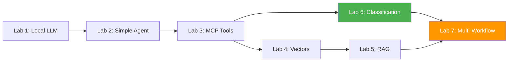

**Lab 6**: Classification system with dual data sources (structured + semantic)

**Lab 7**: Intelligent routing between classification and RAG workflows

---

## Key Takeaways

### 1. Separation of Concerns
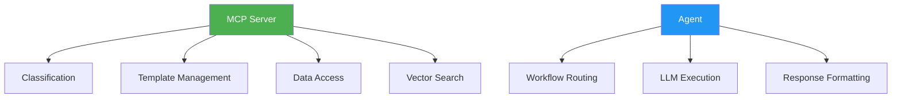

**Server responsibilities**: Query catalog, classification, templates, data
**Agent responsibilities**: Workflow selection, LLM execution, user interaction

### 2. Extensibility
- Add new canonical queries without changing agent code
- Update templates without redeploying agents
- Centralized query evolution

### 3. Consistency
- Every agent uses same classification logic
- Templates ensure uniform LLM prompts
- Standardized data access patterns

### 4. Scalability
- One server supports unlimited agents
- Cached classifications and templates
- Efficient data access

### 5. Intelligent Routing (Lab 7)
- Automatically chooses best workflow
- Structured queries → Classification
- Unstructured queries → RAG
- Optimal performance for each query type

---

## Summary

The **canonical query architecture** transforms AI systems from ad-hoc implementations into **managed, scalable services**:

✅ **Structured classification** replaces guessing
✅ **Template management** ensures consistency
✅ **Centralized logic** simplifies development
✅ **Multi-workflow routing** optimizes performance
✅ **Server-side intelligence** enables reusability

This pattern is production-ready and scales from single agents to enterprise deployments.

---

**For training purposes only. (C) 2025 Tech Skills Transformations and Brent C. Laster - all rights reserved.**
