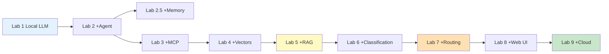

# Architecture Documentation Index

## Overview
This directory contains detailed architecture diagrams for each lab in the Building AI Apps course. Each document includes:
- **Detailed Architecture Diagram**: Complete system view with all components
- **Presentation Slide Diagram**: Simplified diagram for teaching/slides
- **Component Details**: Technical specifications
- **Data Flow**: Step-by-step processing
- **Key Learning Points**: What students should understand

## Lab Architecture Documents

### [Lab 1: Using Ollama to Run Models Locally](./architecture-lab1.md)
**Complexity:** Low | **Type:** Standalone Service

Local LLM execution using Ollama, demonstrating CLI and API interaction.

**Key Components:**
- Ollama Server (:11434)
- Model Storage (llama3.2)
- CLI and HTTP API interfaces

**Learning Focus:**
- Local model execution
- API vs CLI interaction
- Understanding inference latency

---

### [Lab 2: Creating a Simple Agent](./architecture-lab2.md)
**Complexity:** Medium | **Type:** TAO Agent Pattern

Introduction to agentic behavior with tool calling using the TAO (Thought-Action-Observation) pattern.

**Key Components:**
- LLM Planning (llama3.2)
- Weather Tool (Open-Meteo API)
- Converter Tool (Python function)
- TAO Loop

**Learning Focus:**
- Agent reasoning
- Tool calling
- Multi-step workflows
- ReAct pattern

---

### [Lab 3: Exploring MCP (Model Context Protocol)](./architecture-lab3.md)
**Complexity:** Medium-High | **Type:** Client-Server with Standardized Protocol

Introduces MCP as a standardized protocol for agent-tool communication, separating concerns.

**Key Components:**
- MCP Server (:8000)
- MCP Client (FastMCP)
- Tool registry (@mcp.tool decorators)
- HTTP protocol layer

**Learning Focus:**
- Protocol standardization
- Client-server architecture
- Tool discovery
- Separation of concerns

---

### [Lab 4: Working with Vector Databases](./architecture-lab4.md)
**Complexity:** Medium | **Type:** Offline Indexing + Online Search

Vector databases and semantic search using ChromaDB and sentence transformers.

**Key Components:**
- ChromaDB (persistent vector database)
- Embedding Model (all-MiniLM-L6-v2)
- Cosine similarity search
- Indexing tools (code & PDF)

**Learning Focus:**
- Vector embeddings
- Semantic search vs keyword search
- Chunking strategies
- RAG foundation

---

### [Lab 5: Using RAG with Agents](./architecture-lab5.md)
**Complexity:** High | **Type:** RAG-Augmented Agentic Workflow

Combines RAG retrieval with MCP agent, adding vector-based conversation memory.

**Key Components:**
- RAG pipeline (retrieve-augment-generate)
- Vector DB (ChromaDB)
- Information extraction (regex + geocoding)
- MCP tools integration
- Vector memory system

**Learning Focus:**
- RAG pattern
- Context grounding
- Multi-source data integration
- Vector-based semantic memory

---

### [Lab 6: Building a Classification MCP Server](./architecture-lab6.md)
**Complexity:** Medium-High | **Type:** Classification-Based Query System

Transform MCP server to use canonical query classification for structured data analysis.

**Key Components:**
- LLM query classifier
- Canonical query system
- Pandas DataFrame operations
- CSV data layer

**Learning Focus:**
- Query classification
- Canonical queries
- LLM for intent detection
- Server-side intelligence

---

### [Lab 7: Building a Classification-Based RAG Agent](./architecture-lab7.md)
**Complexity:** High | **Type:** Intelligent Multi-Workflow Agent

Combines classification (Lab 6) with RAG (Lab 5) for intelligent query routing.

**Key Components:**
- Intent detection router
- Dual workflow system (data + weather)
- Unified MCP server
- Fallback mechanisms

**Learning Focus:**
- Workflow routing
- Multi-domain agents
- Hybrid systems (structured + unstructured)
- Intelligent decision-making

---

### [Lab 8: Creating a Streamlit Web Application](./architecture-lab8.md)
**Complexity:** High | **Type:** Web Application with Memory Dashboard

Wraps Lab 7 agent in a modern web interface with visual memory dashboard.

**Key Components:**
- Streamlit web framework (:8501)
- Session state management
- Memory dashboard (metrics, entities, history)
- Progress indicators
- Status monitoring

**Learning Focus:**
- Web UI development
- Session state management
- Visual memory representation
- User experience design

---

### [Lab 9: Deploying to Hugging Face Spaces](./architecture-lab9.md)
**Complexity:** High | **Type:** Cloud-Hosted Web Application

Deploy Streamlit app to Hugging Face Spaces for public access.

**Key Components:**
- Hugging Face Space container
- Embedded agent logic (no MCP server)
- Docker configuration
- Optimized model (llama3.2:1b)

**Learning Focus:**
- Cloud deployment
- Container packaging
- Resource optimization
- Public hosting
- Production considerations

---

## Architecture Evolution Across Labs

## Key Architectural Patterns

### 1. TAO Pattern (Lab 2)
Thought → Action → Observation loop for agentic reasoning

### 2. MCP Protocol (Lab 3)
Standardized client-server tool communication

### 3. RAG Pattern (Lab 5)
Retrieval → Augmentation → Generation for grounded responses

### 4. Classification Pattern (Lab 6)
Natural Language → Canonical Query → Structured Execution

### 5. Multi-Workflow Routing (Lab 7)
Intelligent intent detection → Appropriate workflow selection

---

**For training purposes only. (C) 2025 Tech Skills Transformations and Brent C. Laster - all rights reserved.**
