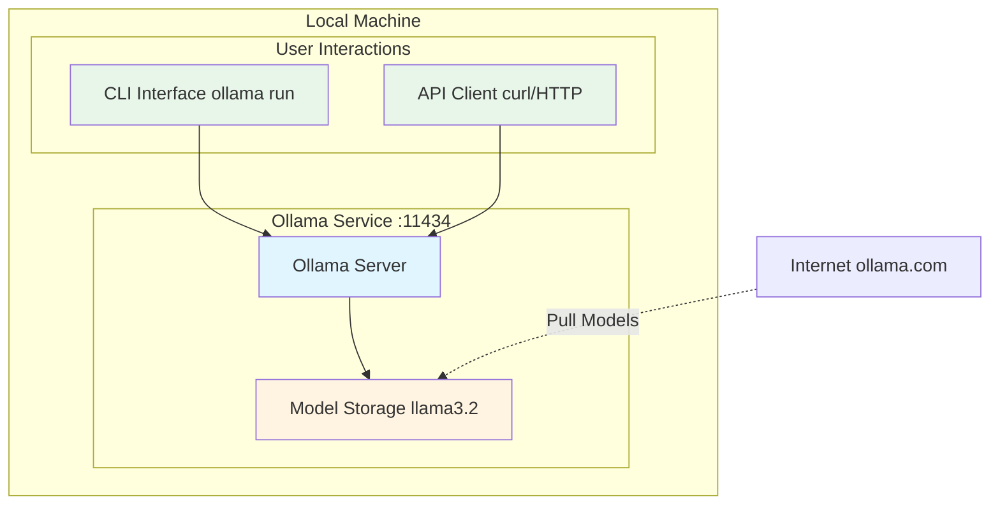
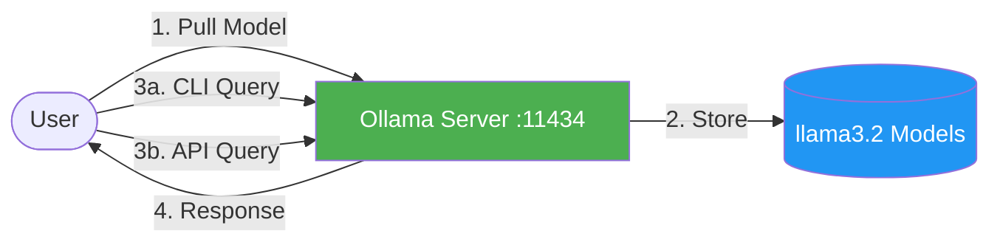

# Lab 1 Architecture: Using Ollama to Run Models Locally

## Overview
Lab 1 introduces local LLM execution using Ollama, demonstrating both interactive CLI and API-based interaction.

## Detailed Architecture Diagram



## Presentation Slide Diagram (Simple)



## Component Details

### 1. Ollama Server
- **Purpose**: Local LLM inference engine
- **Port**: 11434
- **Functionality**:
  - Model management (pull, list, run)
  - Inference execution
  - API endpoint serving

### 2. Model Storage
- **Location**: Local filesystem (~/.ollama/models)
- **Models**: llama3.2 (3B parameters)
- **Format**: GGUF format for efficient inference

### 3. Interaction Methods
- **CLI**: `ollama run llama3.2` - Interactive chat
- **API**: HTTP POST to `/api/generate` - Programmatic access

## Data Flow

1. **Model Download**:
   ```
   User → ollama pull → Internet (ollama.com) → Local Storage
   ```

2. **CLI Interaction**:
   ```
   User Input → Ollama CLI → Model → Response → Terminal
   ```

3. **API Interaction**:
   ```
   curl/HTTP → /api/generate → Model → JSON Response
   ```

## Key Learning Points
- Local LLM execution (no cloud dependency)
- Model management basics
- Two interaction patterns (CLI vs API)
- Understanding inference latency

## Simple Python Example

```python
# simple_ollama.py - Basic Ollama interaction

from langchain_ollama import ChatOllama

# Initialize Ollama client
llm = ChatOllama(model="llama3.2")

# Get user input
user_prompt = input("Enter your prompt: ")

# Send to Ollama and get response
response = llm.invoke(user_prompt)

# Display result
print(f"\nResponse: {response.content}")
```

**Usage**:
```bash
$ python simple_ollama.py
Enter your prompt: What is the capital of France?

Response: The capital of France is Paris.
```

## Architecture Characteristics
- **Type**: Standalone local service
- **Complexity**: Low
- **Dependencies**: None (self-contained)
- **Latency**: ~2-5 seconds per query (local CPU/GPU)

---

**For training purposes only. (C) 2025 Tech Skills Transformations and Brent C. Laster - all rights reserved.**
