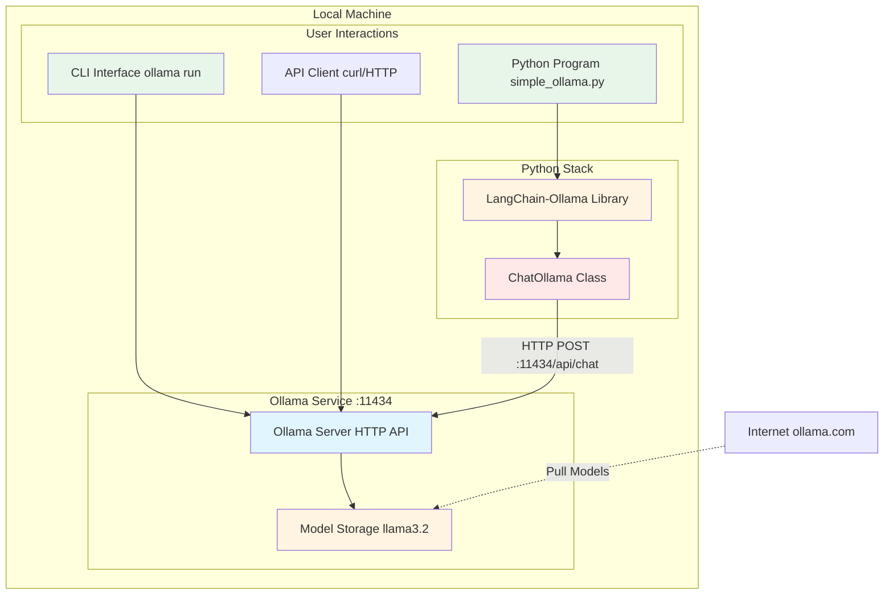
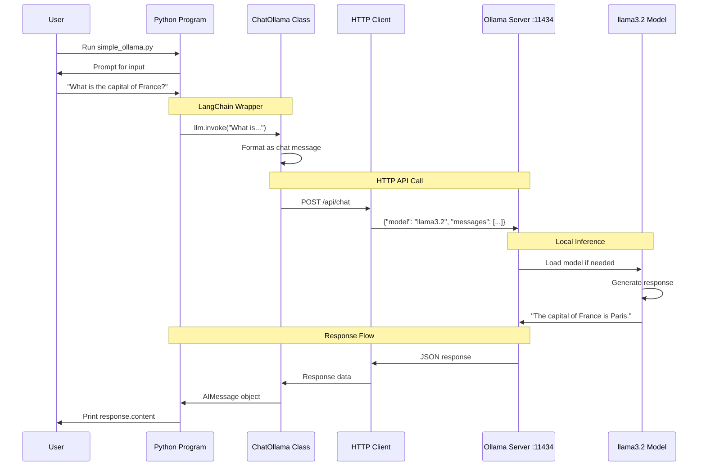
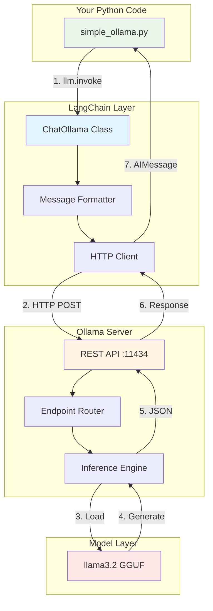
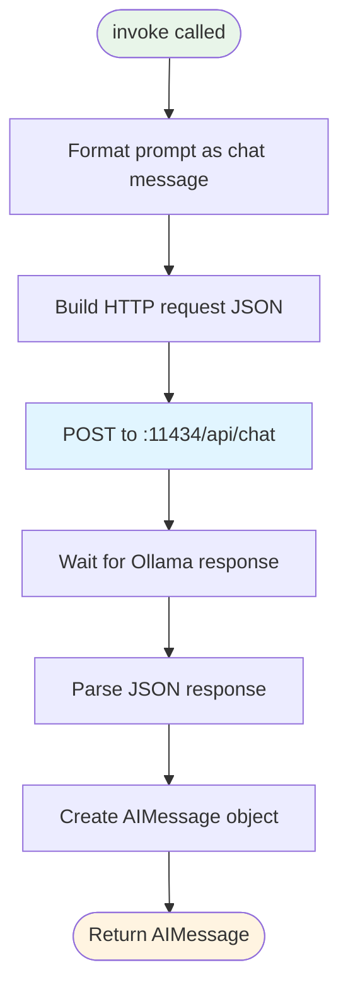

# Lab 1 Architecture: Using Ollama to Run Models Locally

## Overview
Lab 1 introduces local LLM execution using Ollama, demonstrating both interactive CLI and API-based interaction.

## Detailed Architecture Diagram



## Simple Architecture Diagram


## Component Details

### 1. Ollama Server
- **Purpose**: Local LLM inference engine
- **Port**: 11434
- **Functionality**:
  - Model management (pull, list, run)
  - Inference execution
  - API endpoint serving

### 2. Model Storage
- **Location**: Local filesystem (~/.ollama/models)
- **Models**: llama3.2 (3B parameters)
- **Format**: GGUF format for efficient inference

### 3. Interaction Methods

#### Method 1: CLI (Command Line Interface)
- **Command**: `ollama run llama3.2`
- **Use Case**: Interactive chat, testing
- **Protocol**: Direct connection to Ollama server

#### Method 2: Direct HTTP API
- **Endpoint**: `http://localhost:11434/api/generate`
- **Method**: POST request with JSON payload
- **Use Case**: Raw API integration

#### Method 3: Python with LangChain
- **Library**: `langchain-ollama`
- **Class**: `ChatOllama`
- **Protocol**: HTTP API wrapper with high-level interface
- **Use Case**: Building AI applications in Python

## Data Flow

### Flow 1: Model Download
```
User → ollama pull → Internet (ollama.com) → Local Storage (~/.ollama/models)
```

### Flow 2: CLI Interaction
```
User Input → Ollama CLI → HTTP :11434 → Model → Response → Terminal
```

### Flow 3: Python/LangChain Interaction (Lab 1 Focus)



## Key Learning Points
- **Local LLM execution**: No cloud dependency, runs on your machine
- **Model management**: Download, store, and run models via Ollama
- **Three interaction patterns**: CLI, raw HTTP API, Python/LangChain
- **LangChain abstraction**: How frameworks simplify LLM integration
- **ChatOllama class**: Wrapper that handles HTTP communication
- **HTTP protocol**: Understanding client-server communication
- **Inference latency**: Typical 2-5 second response time locally
- **Message format**: How prompts are structured as chat messages

## Comparison: Three Ways to Use Ollama

| Method | Complexity | Use Case | Code Example |
|--------|-----------|----------|--------------|
| **CLI** | Lowest | Testing, exploration | `ollama run llama3.2` |
| **Raw HTTP** | Medium | Custom integrations | `curl -X POST http://localhost:11434/api/chat` |
| **Python/LangChain** | Low | AI applications | `ChatOllama(model="llama3.2").invoke("...")` |

### Why Use LangChain/ChatOllama?

**Without LangChain** (raw HTTP):
```python
import requests
import json

response = requests.post(
    "http://localhost:11434/api/chat",
    json={
        "model": "llama3.2",
        "messages": [{"role": "user", "content": "What is AI?"}],
        "stream": False
    }
)
data = response.json()
print(data["message"]["content"])
```

**With LangChain** (ChatOllama):
```python
from langchain_ollama import ChatOllama

llm = ChatOllama(model="llama3.2")
response = llm.invoke("What is AI?")
print(response.content)
```

**Benefits**:
- Less boilerplate code
- Automatic error handling
- Consistent interface across different LLM providers
- Built-in support for advanced features (streaming, callbacks, etc.)
- Foundation for building agents (Lab 2+)

## Python Integration Deep Dive

### What is LangChain?

**LangChain** is a framework for building applications with Large Language Models (LLMs). It provides:
- **Abstractions**: Common interfaces for different LLM providers
- **Chains**: Connect multiple LLM calls together
- **Memory**: Maintain conversation context
- **Tools**: Integrate LLMs with external functions

In Lab 1, we use the `langchain-ollama` package, which is LangChain's official integration for Ollama.

### What is ChatOllama?

**ChatOllama** is a LangChain class that wraps the Ollama HTTP API, providing:
- **Simplified API**: Clean Python interface instead of raw HTTP
- **Message Formatting**: Automatically formats prompts as chat messages
- **Error Handling**: Manages connection issues gracefully
- **Type Safety**: Returns structured Python objects (AIMessage)

**Under the hood**, ChatOllama:
1. Converts your prompt into Ollama's expected JSON format
2. Makes HTTP POST requests to `http://localhost:11434/api/chat`
3. Parses JSON responses into Python objects
4. Handles streaming and non-streaming responses

### Python Connection Architecture



### Complete Python Example with Explanation

```python
# simple_ollama.py - Basic Ollama interaction

# Step 1: Import LangChain's Ollama integration
from langchain_ollama import ChatOllama

# Step 2: Create ChatOllama instance
# This establishes the connection parameters but doesn't connect yet
llm = ChatOllama(
    model="llama3.2",           # Which Ollama model to use
    base_url="http://localhost:11434",  # Ollama server (default)
    temperature=0.7              # Controls randomness (0=deterministic, 1=creative)
)

# Step 3: Get user input
user_prompt = input("Enter your prompt: ")

# Step 4: Send to Ollama and get response
# invoke() does the following:
#   a. Formats prompt as {"role": "user", "content": "..."}
#   b. POSTs to http://localhost:11434/api/chat
#   c. Waits for response
#   d. Returns AIMessage object
response = llm.invoke(user_prompt)

# Step 5: Display result
# response.content contains the LLM's text response
print(f"\nResponse: {response.content}")
```

### What Happens During `llm.invoke()`?



**HTTP Request Sent**:
```json
POST http://localhost:11434/api/chat
{
  "model": "llama3.2",
  "messages": [
    {
      "role": "user",
      "content": "What is the capital of France?"
    }
  ],
  "stream": false
}
```

**HTTP Response Received**:
```json
{
  "model": "llama3.2",
  "created_at": "2025-01-15T10:30:00Z",
  "message": {
    "role": "assistant",
    "content": "The capital of France is Paris."
  },
  "done": true
}
```

### Usage Example

**Terminal Session**:
```bash
$ python simple_ollama.py
Enter your prompt: What is the capital of France?

Response: The capital of France is Paris.
```

**Behind the Scenes**:
```
1. User runs Python script
2. ChatOllama instance created (no network call yet)
3. User types prompt
4. invoke() called → HTTP POST to localhost:11434
5. Ollama loads llama3.2 model (if not already loaded)
6. Model generates response (~2-5 seconds)
7. Response returned as JSON
8. ChatOllama parses JSON → AIMessage
9. Python prints response.content
```

## Architecture Characteristics
- **Type**: Standalone local service
- **Complexity**: Low
- **Dependencies**: None (self-contained)
- **Latency**: ~2-5 seconds per query (local CPU/GPU)

---

<p align="center">
**For educational use only by the attendees of our workshops.**
</p>

**(C) 2025 Tech Skills Transformations and Brent C. Laster - all rights reserved.**
