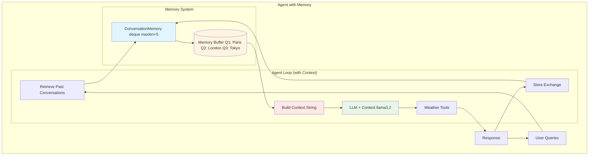
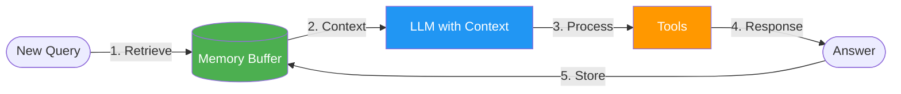
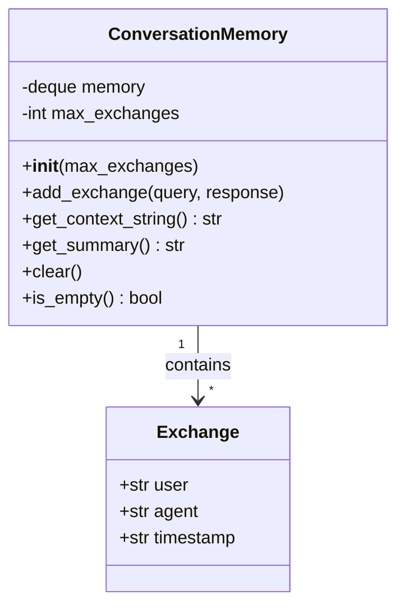
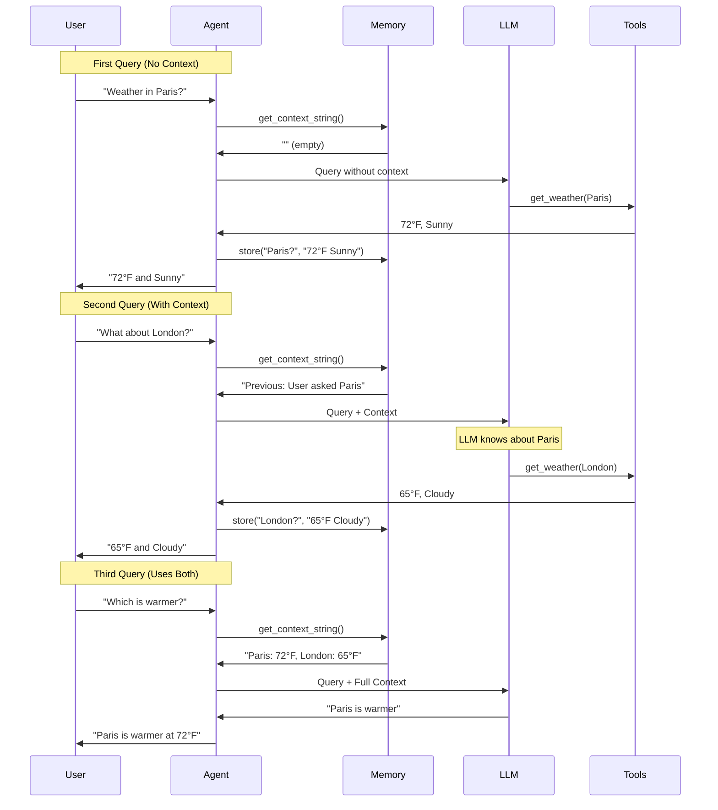
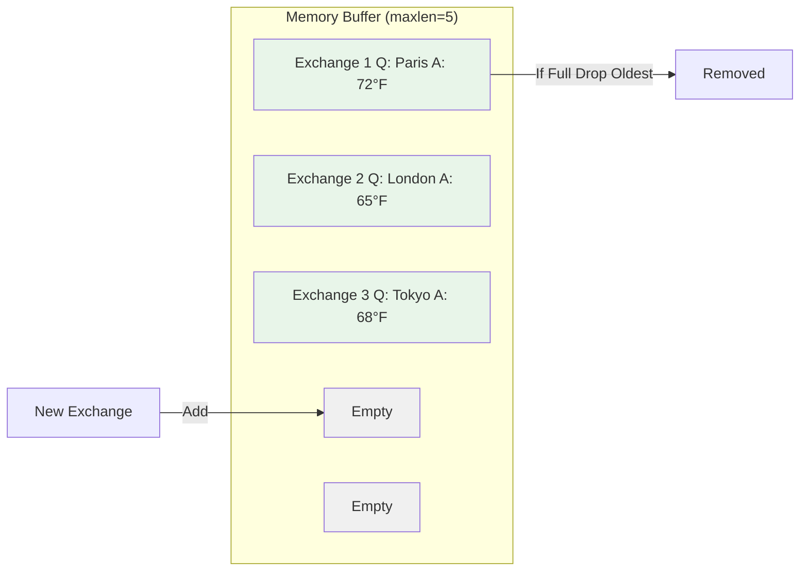

# Lab 2.5 Architecture: Adding Conversation Memory to Agents

## Overview
Lab 2.5 extends Lab 2's agent with conversation memory using a buffer-based approach for context-aware interactions.

## Detailed Architecture Diagram



## Presentation Slide Diagram (Simple)



## ConversationMemory Class Architecture



## Memory Workflow Sequence



## Component Details

### 1. ConversationMemory Class
- **Data Structure**: `deque(maxlen=5)` - Sliding window
- **Storage**: Last 5 query-response pairs
- **Auto-cleanup**: Oldest dropped when full
- **Format**: Dict with user/agent/timestamp

### 2. Context Injection
Before each LLM call:
```python
context = memory.get_context_string()
# Returns:
# "Previous conversation context:
#  User: What's the weather in Paris?
#  Agent: It's 72°F and sunny.
#  User: What about London?
#  Agent: It's 65°F and cloudy."
```

### 3. Memory Buffer States
```
[Empty] → [1/5] → [2/5] → ... → [5/5] → [5/5] (oldest dropped)
```

## Data Flow

**Query 1 (No Context):**
```
User → Empty Memory → LLM → Tools → Response → Store in Memory
```

**Query 2 (With Context):**
```
User → Retrieve Context → LLM + Context → Tools → Response → Store in Memory
```

**Query 3 (Multi-turn):**
```
User → Retrieve All Context → LLM + Full Context → Direct Answer
```

## Memory Visualization



## Key Differences from Lab 2

| Aspect | Lab 2 | Lab 2.5 |
|--------|-------|---------|
| Context | None | Last 5 conversations |
| Multi-turn | No | Yes |
| Memory Type | Stateless | Buffer (deque) |
| Follow-ups | Can't handle | Understands references |
| Complexity | Simple | +30 lines |

## Key Learning Points
- **Sliding Window Memory**: Fixed-size buffer with auto-cleanup
- **Context Injection**: Adding memory to LLM prompts
- **Deque Data Structure**: Efficient FIFO queue
- **Stateful Agents**: Maintaining conversation state
- **Memory Management**: Display, clear, statistics

## Architecture Characteristics
- **Type**: Stateful agent with buffer memory
- **Complexity**: Medium
- **Memory**: In-memory deque (not persistent)
- **Capacity**: 5 exchanges (configurable)
- **Overhead**: ~100 tokens per exchange in context
