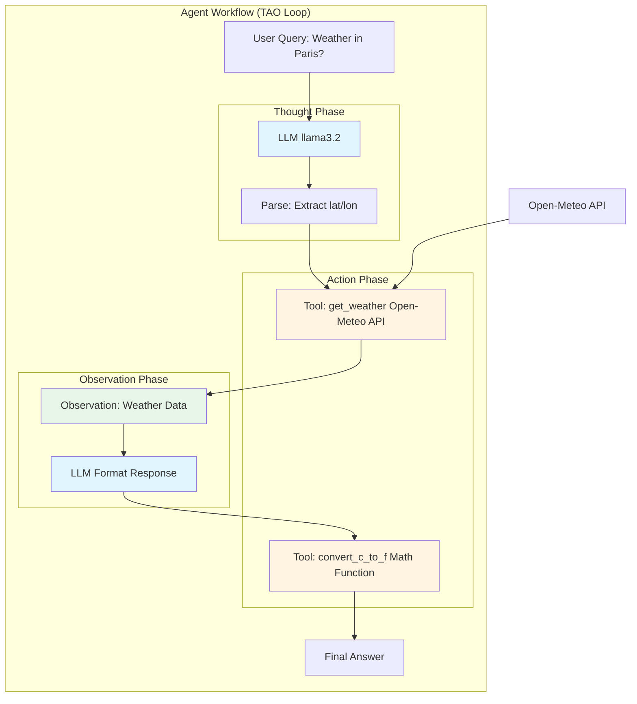
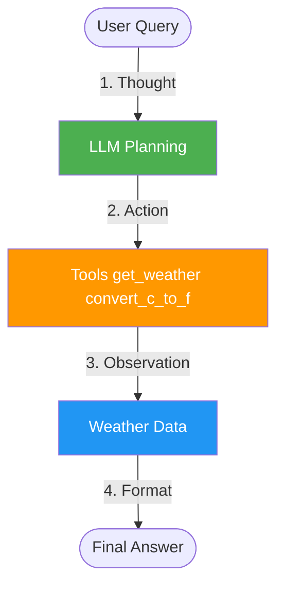
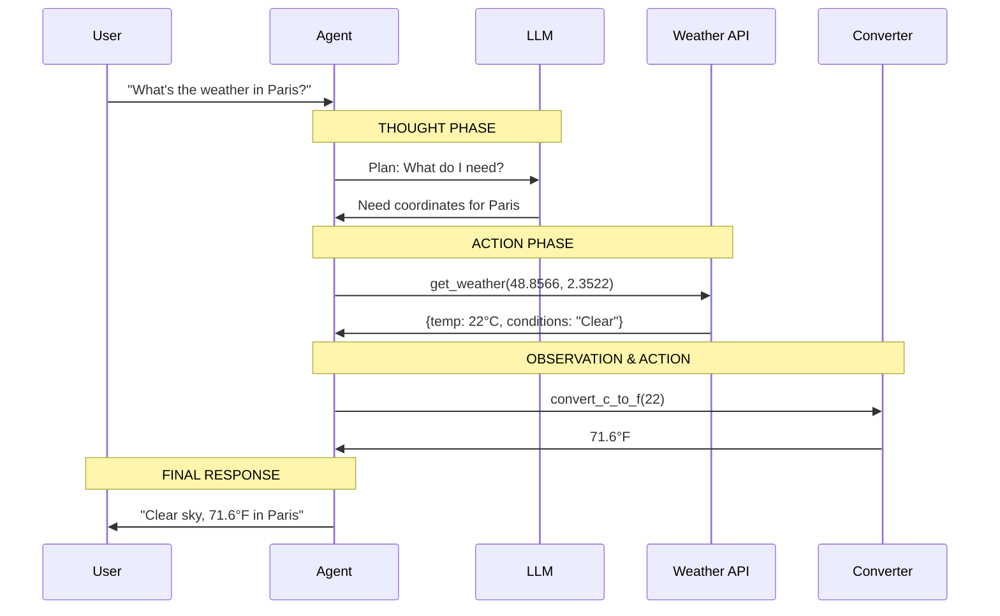

# Lab 2 Architecture: Creating a Simple Agent

## Overview
Lab 2 introduces the TAO (Thought-Action-Observation) agent pattern with tool calling capabilities.

## Detailed Architecture Diagram



## Simple Architecture Diagram



## TAO (Thought-Action-Observation) Pattern



## Component Details

### 1. LLM (llama3.2)
- **Purpose**: Reasoning and planning
- **Input**: User query + system prompt
- **Output**: Tool calls with arguments
- **Framework**: LangChain-Ollama

### 2. Tools
**get_weather(lat, lon)**
- External API call to Open-Meteo
- Returns: temperature (°C), conditions, weather code

**convert_c_to_f(c)**
- Python function: `c * 9/5 + 32`
- Returns: temperature in Fahrenheit

### 3. System Prompt
Defines available tools and TAO format:
```
You are a helpful weather assistant.
Available tools:
1. get_weather(lat, lon)
2. convert_c_to_f(c)

Use TAO format:
- Thought: Your reasoning
- Action: Tool to call
- Args: JSON arguments
```

## Data Flow

1. **User Input** → "What's the weather in Paris?"
2. **Thought** → LLM determines need coordinates (48.8566, 2.3522)
3. **Action 1** → Call `get_weather(48.8566, 2.3522)`
4. **Observation 1** → Receive weather data (22°C, Clear)
5. **Action 2** → Call `convert_c_to_f(22)`
6. **Observation 2** → Receive 71.6°F
7. **Final Response** → Format and return to user

## Key Learning Points
- **Agentic Behavior**: LLM decides which tools to call
- **TAO Pattern**: Structured reasoning loop
- **Tool Calling**: Functions the LLM can execute
- **Multi-step Workflows**: Chaining tool calls
- **ReAct Pattern**: Reasoning + Acting

## Architecture Characteristics
- **Type**: Synchronous agent loop
- **Complexity**: Medium
- **Dependencies**: Ollama, requests library
- **Tools**: 2 (weather API + converter)
- **LLM Calls**: 2 per query (plan + format)

---

<p align="center">
**For educational use only by the attendees of our workshops.**
</p>

**(C) 2025 Tech Skills Transformations and Brent C. Laster - all rights reserved.**
