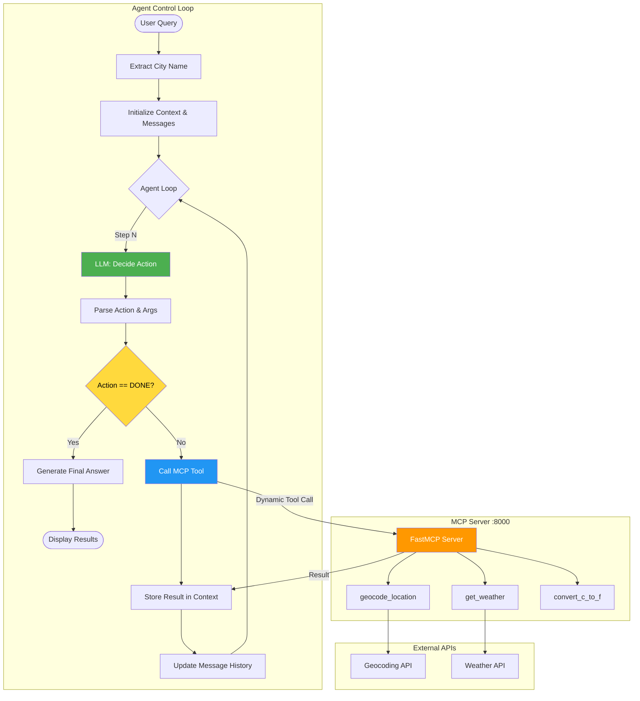
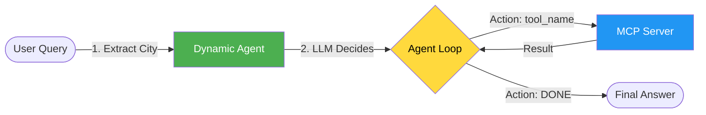
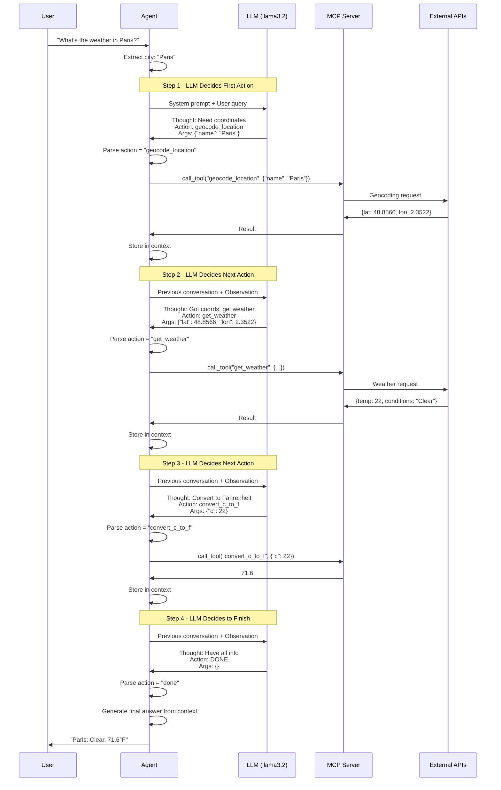
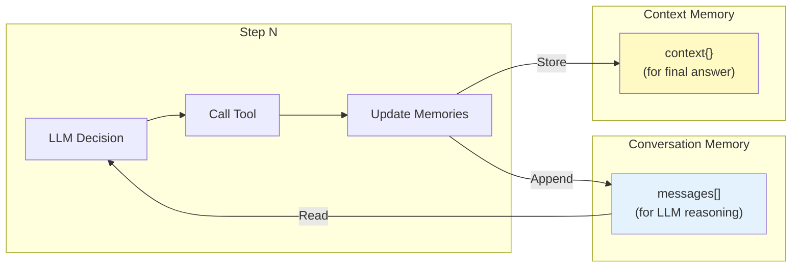

# Lab 3 Dynamic Architecture: True LLM-Controlled Agent with MCP

## Overview
This document describes the **dynamic TAO agent** - a true agentic implementation where the LLM makes real decisions about which tools to call and when to stop. Unlike the simplified Lab 3 version (which uses a hardcoded 3-step sequence), this agent demonstrates genuine autonomous behavior.

## Key Differences: Hardcoded vs Dynamic

| Aspect | Original Lab 3 | Dynamic Lab 3 |
|--------|---------------|---------------|
| **Tool Selection** | Hardcoded sequence | LLM decides each step |
| **Loop Control** | Fixed 3 steps | LLM decides when to stop |
| **Flexibility** | Always same flow | Can adapt to different queries |
| **Error Recovery** | Exits on error | Can retry or adapt |
| **True Agency** | ❌ Simulated | ✅ Real agentic behavior |

## Detailed Architecture Diagram



## Simple Architecture Diagram



## Dynamic TAO Flow (Step-by-Step)



## Component Details

### 1. Dynamic Agent Loop (Core Logic)

```python
for step in range(1, max_steps + 1):
    # LLM decides what to do next
    response = llm.invoke(messages).content.strip()

    # Parse the action LLM chose
    action = ACTION_RE.search(response).group(1).lower()

    # Check if done
    if action == "done":
        generate_final_answer(context)
        return

    # Parse arguments
    args = json.loads(ARGS_RE.search(response).group(1))

    # Dynamically call whatever tool LLM selected
    result = unwrap(await mcp.call_tool(action, args))

    # Store result and update conversation
    update_context(action, result)
    messages.append({"role": "assistant", "content": response})
    messages.append({"role": "user", "content": f"Observation: {result}"})
```

**Key Features:**
- ✅ Action determined by parsing LLM response
- ✅ Loop continues until LLM says "DONE"
- ✅ No hardcoded tool sequence
- ✅ Conversation history maintained

### 2. Enhanced System Prompt

```python
SYSTEM = """
You are a weather information agent with access to these tools:

geocode_location(name: str) → {"latitude": float, "longitude": float, "name": str}
get_weather(lat: float, lon: float) → {"temperature": float, "conditions": str}
convert_c_to_f(c: float) → float

When you have enough information, respond with:
Thought: I have all the information needed
Action: DONE
Args: {}

For each step where you need a tool, respond with:
Thought: <reasoning>
Action: <tool_name or DONE>
Args: <valid JSON>
"""
```

**Key Elements:**
- Clear tool descriptions with signatures
- Explicit DONE instruction
- Precise formatting requirements
- No ambiguity about response format

### 3. Dual Memory System

The agent uses **two complementary memory systems**:

#### A. Conversation Memory (Message History)
```python
messages = [
    {"role": "system", "content": SYSTEM},
    {"role": "user", "content": f"What is the weather in {city}?"},
]

# After each step, append to history
messages.append({"role": "assistant", "content": response})  # LLM's plan
messages.append({"role": "user", "content": observation})    # Tool result
```

**Purpose:**
- LLM sees full conversation history
- Enables reasoning about previous steps
- TAO trace visible to LLM
- Grows with each tool call

#### B. Context Memory (State Dictionary)
```python
context = {
    "city": city,
    "latitude": None,
    "longitude": None,
    "temperature_c": None,
    "temperature_f": None,
    "conditions": None,
}

# After each tool call, update relevant fields
if action == "geocode_location":
    context["latitude"] = result.get("latitude")
    context["longitude"] = result.get("longitude")
elif action == "get_weather":
    context["temperature_c"] = result.get("temperature")
    context["conditions"] = result.get("conditions")
elif action == "convert_c_to_f":
    context["temperature_f"] = float(result)
```

**Purpose:**
- Stores extracted structured data
- Tool-agnostic (works with any call order)
- Used to generate final answer
- Fixed size (doesn't grow)

#### Memory Architecture



**Why Two Systems?**
- **Conversation Memory**: LLM needs full conversation context for reasoning
- **Context Memory**: Application needs structured data for final output
- They serve different consumers (LLM vs application code)
- Both updated after each tool call

### 4. Error Recovery

```python
try:
    result = unwrap(await mcp.call_tool(action, args))
except ToolError as e:
    # Add error to conversation - let LLM adapt
    messages.append({"role": "assistant", "content": response})
    messages.append({"role": "user", "content": f"Observation: Error - {e}"})
    continue  # LLM can try different approach
```

**Benefits:**
- LLM aware of errors
- Can retry with different arguments
- Can choose alternative tool
- Graceful degradation

## Flexible Query Handling

### Example 1: Standard Weather Query
```
User: "What's the weather in Tokyo?"

Step 1: Action: geocode_location → Get coordinates
Step 2: Action: get_weather → Get weather data
Step 3: Action: convert_c_to_f → Convert temperature
Step 4: Action: DONE → Output answer
```

### Example 2: User Provides Coordinates
```
User: "Weather at 35.6762, 139.6503?"

Step 1: Action: get_weather → Skip geocoding!
Step 2: Action: convert_c_to_f → Convert temperature
Step 3: Action: DONE → Output answer
```

### Example 3: Celsius Acceptable
```
User: "What's the temperature in Paris in Celsius?"

Step 1: Action: geocode_location → Get coordinates
Step 2: Action: get_weather → Get weather data
Step 3: Action: DONE → Skip conversion!
```

### Example 4: Error Recovery
```
User: "Weather in Pariis?" (typo)

Step 1: Action: geocode_location("Pariis") → Error
Step 2: Action: geocode_location("Paris") → Success (LLM fixes typo)
Step 3: Action: get_weather → Get weather data
Step 4: Action: convert_c_to_f → Convert
Step 5: Action: DONE → Output answer
```

## Comparison: Original vs Dynamic

### Original Lab 3 (Simplified)

```python
# ALWAYS does this sequence, no matter what
plan1 = llm.invoke(messages)  # LLM suggests geocode
result1 = await mcp.call_tool("geocode_location", args1)  # Hardcoded

plan2 = llm.invoke(messages)  # LLM suggests weather
result2 = await mcp.call_tool("get_weather", args2)  # Hardcoded

plan3 = llm.invoke(messages)  # LLM suggests convert
result3 = await mcp.call_tool("convert_c_to_f", {"c": temp})  # Hardcoded
```

**Issues:**
- LLM's action suggestions ignored
- Can't skip steps
- Can't adapt to errors
- Not truly agentic

### Dynamic Lab 3 (True Agency)

```python
while not done:
    plan = llm.invoke(messages)
    action = parse_action(plan)  # Read what LLM wants

    if action == "done":
        break

    result = await mcp.call_tool(action, args)  # Use LLM's choice
    context.update(result)
    messages.append(observation)
```

**Benefits:**
- ✅ LLM decisions control execution
- ✅ Can adapt sequence dynamically
- ✅ Can skip unnecessary steps
- ✅ Can recover from errors
- ✅ True autonomous behavior

## Data Flow Comparison

### Original (Hardcoded)
```
User → Extract City → LLM (ignored) → geocode_location
                   → LLM (ignored) → get_weather
                   → LLM (ignored) → convert_c_to_f
                   → Display
```

### Dynamic (LLM-Controlled)
```
User → Extract City → Loop:
                      ├─ LLM → Parse Action → Execute Tool
                      ├─ Update Context
                      ├─ Update History
                      └─ Continue or DONE
                   → Generate Answer from Context
```

## MCP Integration

Both versions use the **same MCP server** with the same tools:

```python
# MCP Server provides these tools
@mcp.tool()
def geocode_location(name: str) -> dict

@mcp.tool()
def get_weather(lat: float, lon: float) -> dict

@mcp.tool()
def convert_c_to_f(c: float) -> float
```

**The difference is in the agent:**
- **Original**: Agent code decides which tools to call (hardcoded)
- **Dynamic**: LLM decides which tools to call (autonomous)

Both make HTTP requests to `http://127.0.0.1:8000/mcp/` with the tool name and arguments.

## Architecture Characteristics

| Characteristic | Value |
|---------------|-------|
| **Type** | Dynamic agent loop with MCP tools |
| **Complexity** | High (true agentic behavior) |
| **Dependencies** | FastMCP, LangChain, Ollama |
| **Control** | LLM-driven (autonomous) |
| **Flexibility** | High (adapts to query variations) |
| **Error Handling** | Robust (can retry/adapt) |
| **Scalability** | High (MCP server shared) |
| **Latency** | Variable (depends on LLM decisions) |

## Key Learning Points

### 1. True Agency
- LLM makes real decisions
- Agent loop responds to LLM choices
- Not just template filling

### 2. Dynamic Tool Selection
- Parse `Action:` line to determine tool
- Call tools based on LLM reasoning
- No hardcoded sequence

### 3. Flexible Completion
- LLM decides when enough info gathered
- `Action: DONE` signals completion
- Not fixed number of steps

### 4. Context Awareness
- All information tracked in context dict
- Available for final answer generation
- Tool-order agnostic

### 5. Error Resilience
- Errors fed back to LLM
- LLM can adapt strategy
- Graceful degradation

### 6. Conversation History
- Full TAO trace maintained
- LLM sees all previous observations
- Enables reasoning about prior steps

## When to Use Each Approach

### Use Original (Hardcoded) When:
- Teaching fundamental concepts
- Predictable demo needed
- Simplicity preferred
- Students learning MCP basics

### Use Dynamic (LLM-Controlled) When:
- Teaching true agentic systems
- Demonstrating autonomous behavior
- Need flexible query handling
- Production-like implementation needed

## Benefits of Dynamic Approach

1. **True Autonomy**: LLM actually controls execution
2. **Adaptability**: Can handle query variations
3. **Efficiency**: Can skip unnecessary steps
4. **Robustness**: Can recover from errors
5. **Realistic**: Matches production agent patterns
6. **Educational**: Shows real agent architecture

## Trade-offs

| Aspect | Original | Dynamic |
|--------|----------|---------|
| **Complexity** | Low | Higher |
| **Predictability** | High | Variable |
| **Demo Clarity** | Excellent | Good |
| **Real-World Match** | Low | High |
| **Learning Curve** | Gentle | Steeper |
| **Code Length** | Shorter | Longer |

## Summary

The **dynamic TAO agent** represents a true agentic implementation where:

✅ **LLM makes real decisions** about which tools to call
✅ **Loop continues until LLM signals completion**
✅ **Can adapt to different query types**
✅ **Recovers from errors autonomously**
✅ **Maintains conversation context**
✅ **Still uses same MCP server and tools**

This is how production agent systems work - the LLM is in control, and the agent framework executes its decisions. The original Lab 3 version is pedagogically simpler but not truly agentic. The dynamic version shows authentic autonomous behavior.

---

<p align="center">
**For educational use only by the attendees of our workshops.**
</p>

**(C) 2025 Tech Skills Transformations and Brent C. Laster - all rights reserved.**
