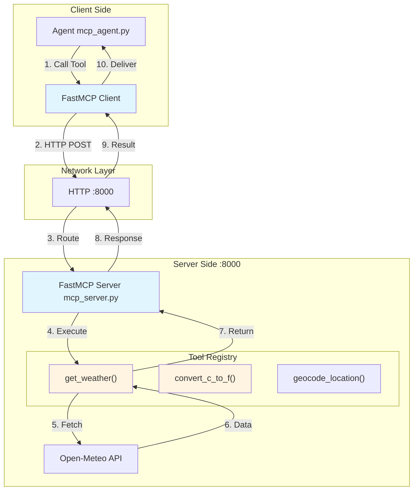
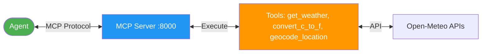
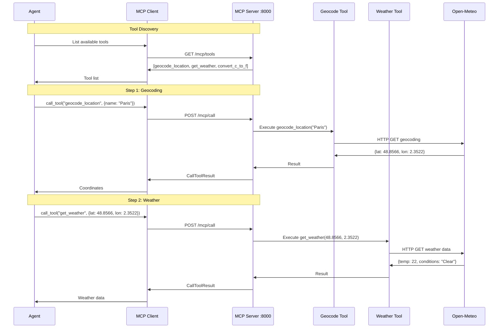
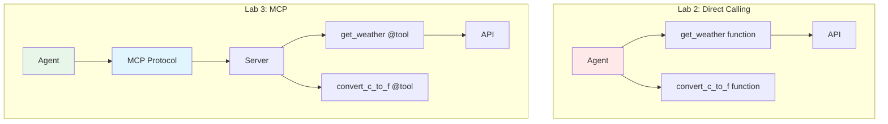

# Lab 3 Architecture: Exploring MCP (Model Context Protocol)

## Overview
Lab 3 introduces MCP as a standardized protocol for agent-tool communication, separating tool implementation from agent logic.

## Detailed Architecture Diagram



## Simple Architecture Diagram



## MCP Protocol Flow



## Component Details

### 1. MCP Server (mcp_server.py)
```python
@mcp.tool()
def get_weather(lat: float, lon: float) -> dict:
    """Get weather for coordinates with retry logic"""
    # Retries up to 3 times with fresh connections
    # Returns {temperature, code, conditions} or {error}
    return weather_data

@mcp.tool()
def convert_c_to_f(c: float) -> float:
    """Convert Celsius to Fahrenheit"""
    return c * 9/5 + 32

@mcp.tool()
def geocode_location(name: str) -> dict:
    """Geocode location name to coordinates with retry logic"""
    # Retries up to 3 times with fresh connections
    # Returns {latitude, longitude, name} or {error}
    return coordinates
```

**Responsibilities:**
- Host tools as HTTP endpoints
- Handle tool discovery
- Execute tool functions with robust retry logic
- Return standardized results (success or graceful errors)

### 2. MCP Client (in agent)
```python
from fastmcp import Client

async with Client("http://127.0.0.1:8000/mcp/") as mcp:
    result = await mcp.call_tool("get_weather", {"lat": 48, "lon": 2})
```

**Responsibilities:**
- Connect to MCP server
- Discover available tools
- Make tool calls
- Handle responses

### 3. Tool Decorator Pattern
```python
@mcp.tool()
def tool_name(params) -> return_type:
    """Docstring becomes tool description"""
    return result
```

## MCP vs Direct Tool Calling



## Key Differences from Lab 2

| Aspect | Lab 2 | Lab 3 (MCP) |
|--------|-------|-------------|
| Tools | In agent code | Separate server |
| Communication | Direct function calls | HTTP/MCP protocol |
| Tool Discovery | Hardcoded | Dynamic via MCP |
| Separation | Tight coupling | Loose coupling |
| Scalability | Limited | High (server can serve multiple agents) |
| Protocol | None | Standardized (MCP) |

## Data Flow

1. **Server Startup**:
   ```
   python mcp_server.py → Listen on :8000 → Register tools
   ```

2. **Agent Connection**:
   ```
   Agent → MCP Client → HTTP :8000 → Discover tools
   ```

3. **Tool Call**:
   ```
   Agent → call_tool() → HTTP POST → Server → Execute → API → Result
   ```

## Network Protocol

**Tool Call Request:**
```json
POST /mcp/call
{
  "tool": "get_weather",
  "arguments": {"lat": 48.8566, "lon": 2.3522}
}
```

**Tool Call Response:**
```json
{
  "result": {
    "temperature": 22,
    "conditions": "Clear sky"
  }
}
```

## Key Learning Points
- **Protocol Standardization**: MCP provides consistent tool interface
- **Separation of Concerns**: Tools separate from agent logic
- **Network Communication**: HTTP-based tool execution
- **Tool Discovery**: Dynamic registration and discovery
- **Server-Client Pattern**: Multi-agent architecture support
- **Decorator Pattern**: Clean tool registration with `@mcp.tool()`
- **Robust Error Handling**: Fresh connections per retry, graceful error responses
- **API Resilience**: Exponential backoff for transient failures (429, 5xx)

## Architecture Characteristics
- **Type**: Client-server with standardized protocol
- **Complexity**: Medium-High
- **Dependencies**: FastMCP, HTTP server
- **Network**: Local (127.0.0.1:8000)
- **Scalability**: Multiple agents can share one server
- **Latency**: +HTTP overhead (~10-50ms local)

## Benefits of MCP

1. **Modularity**: Tools in separate process
2. **Reusability**: One server, many agents
3. **Standardization**: Common protocol across tools
4. **Security**: Server can enforce access control
5. **Versioning**: Server can manage tool versions
6. **Language Agnostic**: Agents can be in different languages

---

For educational use only by the attendees of our workshops.

**For training purposes only. (C) 2025 Tech Skills Transformations and Brent C. Laster - all rights reserved.**

