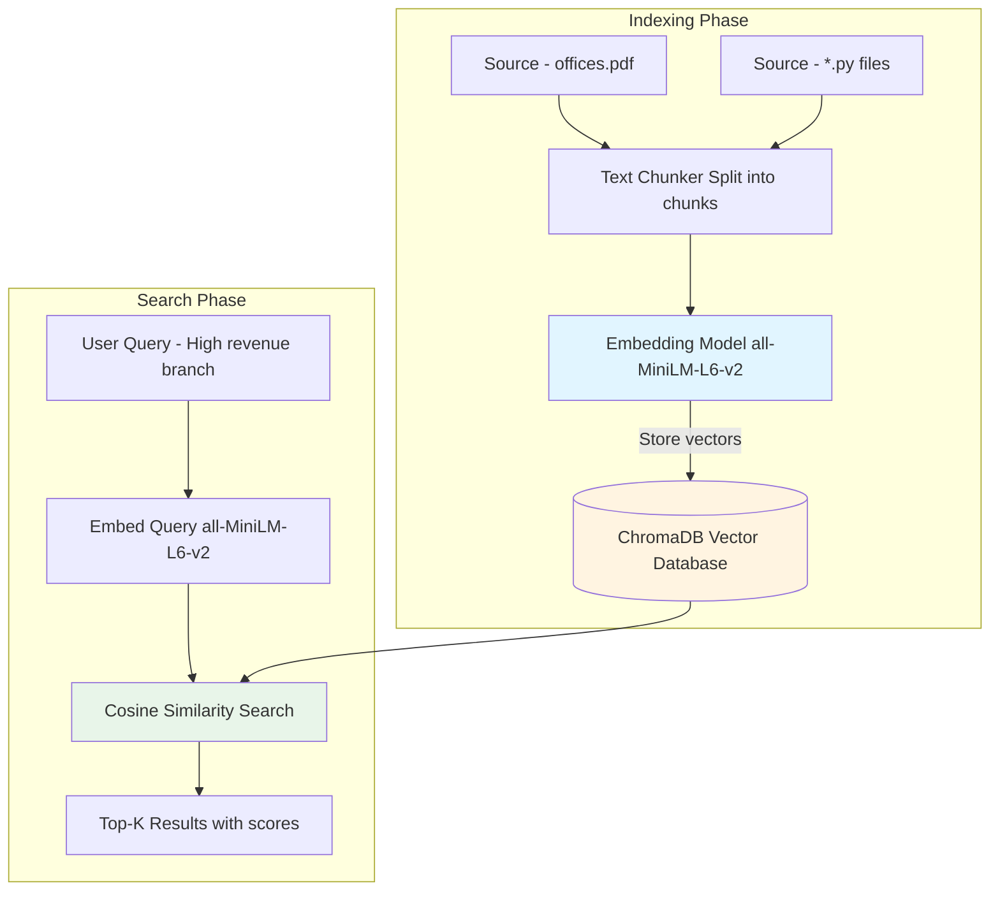
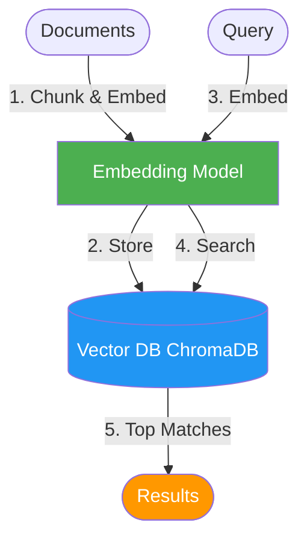
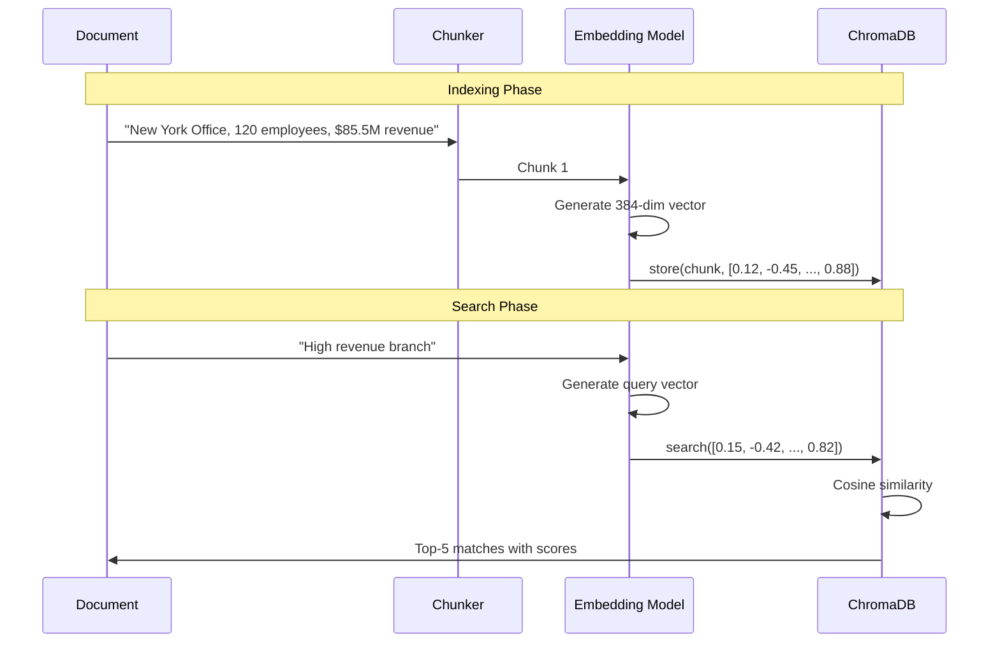
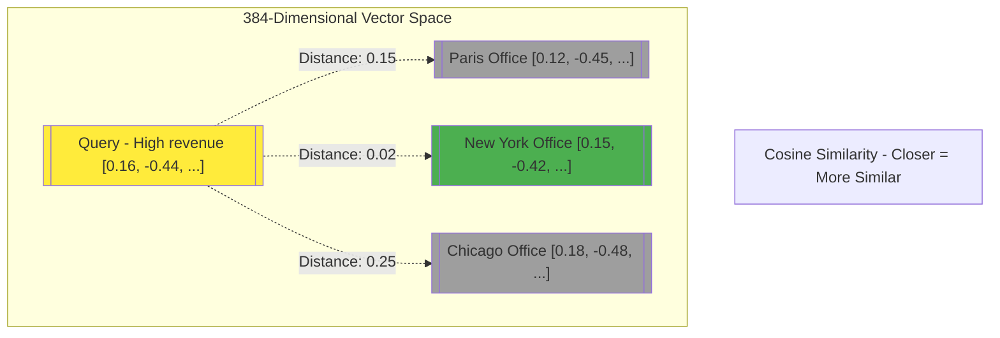
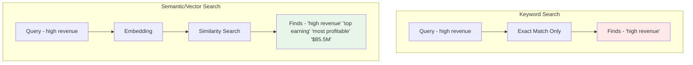

# Lab 4 Architecture: Working with Vector Databases

## Overview
Lab 4 introduces vector databases (ChromaDB) for semantic search and similarity matching, enabling RAG capabilities.

## Detailed Architecture Diagram



## Presentation Slide Diagram (Simple)



## Vector Embedding Process



## Component Details

### 1. Embedding Model (SentenceTransformer)
```python
model = SentenceTransformer("all-MiniLM-L6-v2")
embedding = model.encode(text)  # Returns 384-dim vector
```

**Specifications:**
- Model: all-MiniLM-L6-v2
- Dimensions: 384
- Size: ~80MB
- Speed: ~1000 sentences/sec on CPU

### 2. ChromaDB
```python
client = chromadb.PersistentClient(path="./chroma_db")
collection = client.get_or_create_collection("codebase")

# Add documents
collection.add(
    documents=["text chunk"],
    embeddings=[[0.12, -0.45, ...]],
    ids=["chunk_1"]
)

# Search
results = collection.query(
    query_embeddings=[[0.15, -0.42, ...]],
    n_results=5
)
```

**Features:**
- Persistent storage on disk
- Cosine similarity search
- Metadata filtering
- Efficient indexing (HNSW)

### 3. Indexing Tools

**index_code.py**: Index Python files
```python
for file in glob("**/*.py"):
    chunks = chunk_text(file.read_text())
    embeddings = model.encode(chunks)
    collection.add(documents=chunks, embeddings=embeddings)
```

**index_pdf.py**: Index PDF documents
```python
pdf_text = extract_text_from_pdf("offices.pdf")
chunks = chunk_text(pdf_text)
embeddings = model.encode(chunks)
collection.add(documents=chunks, embeddings=embeddings)
```

### 4. Search Tool (search.py)
```python
query_embedding = model.encode(user_query)
results = collection.query(
    query_embeddings=[query_embedding],
    n_results=5
)
# Returns: documents + cosine similarity scores
```

## Vector Space Visualization



## Data Flow

### Indexing Flow
```
Source Files → Read Text → Chunk (512 chars) → Embed → Store in ChromaDB
```

**Example:**
```
offices.pdf (10 offices) → 50 chunks → 50 embeddings → ChromaDB collection
```

### Search Flow
```
User Query → Embed → Cosine Similarity Search → Top-K Results → Display
```

**Example:**
```
"High revenue" → [0.16, -0.44, ...] → Search → Top 5 matches → Print scores
```

## Cosine Similarity Calculation

```mermaid
graph LR
    A[Query Vector q = [0.16, -0.44, ...]] --> CS[Cosine Similarity]
    B[Document Vector d = [0.15, -0.42, ...]] --> CS
    CS --> Score["Score - 0.98 Very Similar"]

    style CS fill:#e1f5ff
    style Score fill:#e8f5e9
```

**Formula:**
```
similarity = (q · d) / (||q|| * ||d||)
Range: [-1, 1], typically [0, 1] for semantic search
```

## Comparison: Keyword vs. Semantic Search



## Key Learning Points
- **Vector Embeddings**: Text → Numeric representation
- **Semantic Search**: Find similar meaning, not just keywords
- **Cosine Similarity**: Measure distance in vector space
- **Chunking Strategy**: Split long documents for better matching
- **Persistence**: ChromaDB stores vectors on disk
- **Embedding Models**: Pre-trained models encode semantic meaning

## Architecture Characteristics
- **Type**: Offline indexing + Online search
- **Complexity**: Medium
- **Dependencies**: SentenceTransformers, ChromaDB
- **Storage**: Disk-based (./chroma_db/)
- **Search Speed**: ~100ms for 1000 vectors (local)
- **Scalability**: Handles millions of vectors

## Performance Metrics

| Metric | Value |
|--------|-------|
| Embedding Speed | ~1000 sentences/sec |
| Index Size (10 offices) | ~50 chunks, ~20KB |
| Search Latency | 10-100ms |
| Vector Dimensions | 384 |
| Top-K Results | 5 (configurable) |

## Use Cases Enabled
1. **Document Search**: Find relevant content semantically
2. **Code Search**: Find similar code patterns
3. **Question Answering**: Retrieve context for answers
4. **Recommendation**: Find similar items
5. **RAG Foundation**: Retrieval for generation (Lab 5)
