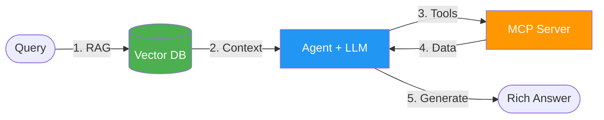
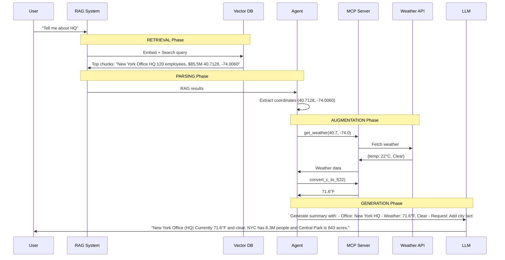
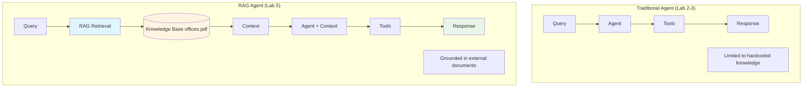

# Lab 5 Architecture: Using RAG with Agents

## Overview
Lab 5 combines RAG (Retrieval-Augmented Generation) with the MCP agent from Lab 3, enabling the agent to answer questions using external knowledge from vector databases.

## Detailed Architecture Diagram

```mermaid
graph TB
    subgraph "RAG + Agent Architecture"
        User[User Query: "Tell me about HQ"]

        subgraph "RAG Pipeline"
            Embed1[Embed Query all-MiniLM-L6-v2]
            VectorDB[(ChromaDB offices.pdf indexed)]
            Retrieve[Retrieve Top-K Relevant Chunks]
        end

        subgraph "Agent Processing"
            Parse[Parse Location from RAG results]
            LLM[LLM Planning llama3.2]
        end

        subgraph "MCP Tools :8000"
            MCPServer[MCP Server]
            Weather[get_weather]
            Convert[convert_c_to_f]
            Geocode[geocode_location]
        end

        subgraph "Final Generation"
            LLM2[LLM Summary + City Fact]
            Response[User-Friendly Response]
        end

        User --> Embed1
        Embed1 --> VectorDB
        VectorDB --> Retrieve
        Retrieve --> Parse
        Parse --> LLM
        LLM --> MCPServer
        MCPServer --> Weather
        Weather --> LLM2
        MCPServer --> Convert
        Convert --> LLM2
        LLM2 --> Response
        Response --> User
    end

    API[Open-Meteo API] --> Weather

    style VectorDB fill:#fff4e1
    style LLM fill:#e1f5ff
    style LLM2 fill:#e1f5ff
    style MCPServer fill:#e8f5e9
```

## Presentation Slide Diagram (Simple)



## RAG + Agent Flow



## Component Details

### 1. RAG Search Function
```python
def rag_search(query: str, model, collection) -> List[str]:
    # Embed the query
    q_emb = model.encode(query).tolist()

    # Search vector DB
    results = collection.query(
        query_embeddings=[q_emb],
        n_results=TOP_K
    )

    # Return top matching chunks
    return results["documents"][0]
```

### 2. Information Extraction Helpers
```python
def find_coords(texts) -> Optional[Tuple[float, float]]:
    """Extract lat/lon from RAG results"""

def find_city_state(texts) -> Optional[str]:
    """Extract 'City, ST' format"""

def find_city_country(texts) -> Optional[str]:
    """Extract 'City, Country' format"""

async def geocode_via_mcp(name: str, mcp_client) -> Optional[Tuple[float, float]]:
    """Geocode city name via MCP server (with built-in retry logic)"""
    # Delegates to MCP server's geocode_location tool
    # Server handles retries with fresh connections
```

### 3. Enhanced LLM Generation
```python
# System prompt includes instructions for:
# 1. Office name and location
# 2. Current weather
# 3. Interesting city fact

llm.invoke([
    {"role": "system", "content": system_prompt},
    {"role": "user", "content": f"""
        Office: {rag_context}
        Weather: {weather_data}
        Task: Create friendly 3-sentence summary
    """}
])
```


## RAG vs. Traditional Agent



## Data Flow: Complete Pipeline

1. **User Query**: "Tell me about HQ"

2. **RAG Retrieval**:
   ```
   Query → Embed → Search ChromaDB → Top-5 chunks
   Result: "New York Office HQ, 120 employees, $85.5M, coordinates..."
   ```

3. **Information Extraction**:
   ```
   RAG chunks → Regex parsing → Extract coords (40.7128, -74.0060)
   Fallback: City name → MCP geocode_location tool → Coordinates
   ```

4. **MCP Tool Calls**:
   ```
   geocode_location("Paris") → {lat: 48.8566, lon: 2.3522} (if needed)
   get_weather(40.7, -74.0) → {temp: 22°C, Clear}
   convert_c_to_f(22) → 71.6°F
   ```

5. **LLM Generation**:
   ```
   Context: Office info + Weather data
   Task: Generate friendly summary + city fact
   Output: 3 sentences
   ```

## Key Differences from Previous Labs

| Feature | Lab 2-3 | Lab 4 | Lab 5 |
|---------|---------|-------|-------|
| Knowledge | Hardcoded | Indexed | RAG-Retrieved |
| Context | None | Static vectors | Dynamic retrieval |
| Tools | Weather | None | Weather |
| Generation | Simple | None | Rich (office + weather + fact) |
| LLM Calls | 1-2 | 0 | 1-2 |

## Information Extraction Pipeline

```mermaid
flowchart TD
    RAG[RAG Top Hit: "New York Office, 40.7128, -74.0060"]

    Try1{Coordinates in text?}
    Try2{City, State pattern?}
    Try3{City, Country pattern?}
    Try4{Capitalized word?}

    Coords[Extract Coords 40.7, -74.0]
    CityState[Extract: "New York, NY"]
    CityCountry[Extract: "Paris, France"]
    City[Extract: "London"]

    Geocode[MCP geocode_location tool Get Coordinates with Retry]

    RAG --> Try1
    Try1 -->|Yes| Coords
    Try1 -->|No| Try2
    Try2 -->|Yes| CityState
    Try2 -->|No| Try3
    Try3 -->|Yes| CityCountry
    Try3 -->|No| Try4
    Try4 -->|Yes| City

    CityState --> Geocode
    CityCountry --> Geocode
    City --> Geocode

    Coords --> Final[Final Coordinates]
    Geocode --> Final

    style Try1 fill:#e1f5ff
    style Coords fill:#e8f5e9
    style Geocode fill:#fff4e1
```

## Key Learning Points
- **RAG Pattern**: Retrieval → Augment → Generate
- **Context Grounding**: LLM responses based on retrieved documents
- **Multi-step Processing**: RAG → Parse → Tools → Generate
- **Information Extraction**: Regex + fallbacks for robust parsing
- **LLM Enhancement**: Rich generation with multiple data sources
- **Centralized API Calls**: All external APIs (weather + geocoding) via MCP server
- **Resilient Architecture**: MCP server handles retries with fresh connections

## Architecture Characteristics
- **Type**: RAG-augmented agentic workflow
- **Complexity**: High
- **Dependencies**: ChromaDB, MCP, SentenceTransformers, Ollama
- **LLM Calls**: 1-2 per query
- **Latency**: ~5-10 seconds (RAG + Tools + Generation)
- **Knowledge**: External (PDF documents)

## RAG Benefits
1. **Grounded Responses**: Answers based on documents, not hallucinations
2. **Updatable Knowledge**: Change PDFs without retraining LLM
3. **Cited Sources**: Can trace answers back to source chunks
4. **Domain-Specific**: Specialized knowledge (office data)
5. **Scalable**: Add more documents without model changes
6. **Contextual**: Combines retrieval with reasoning
