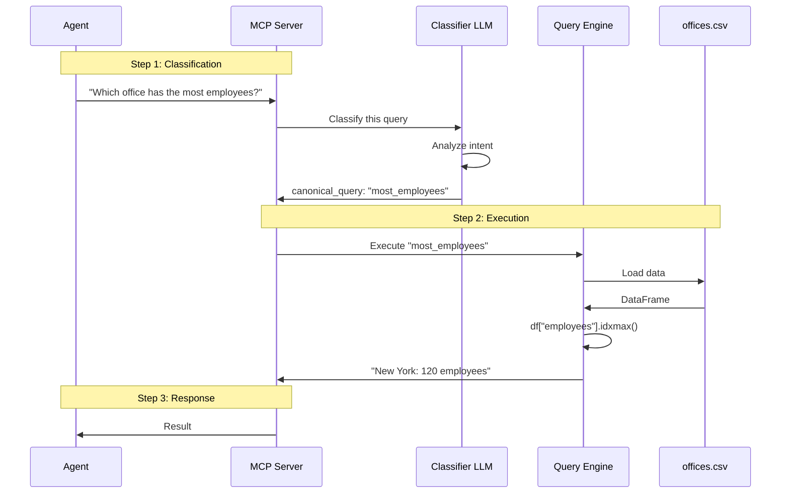
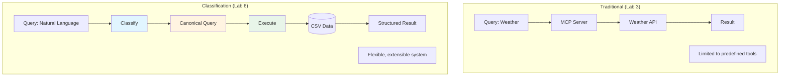
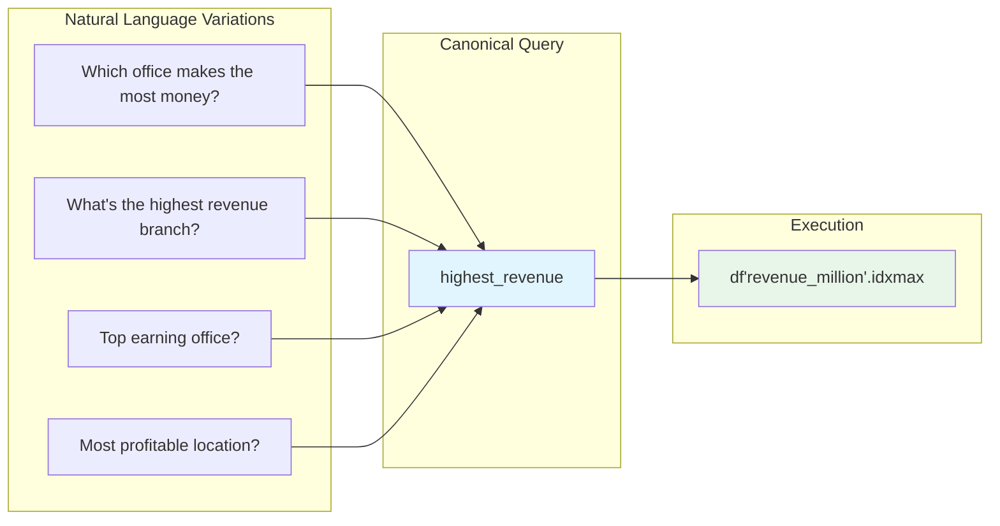
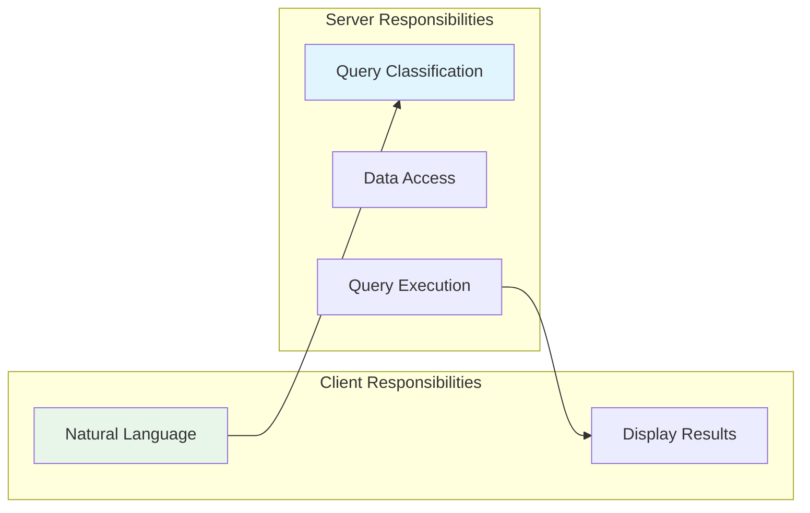

# Lab 6 Architecture: Building a Classification MCP Server

## Overview
Lab 6 transforms the MCP server to use canonical query classification, creating a scalable architecture where the server manages query interpretation and templates.

## Detailed Architecture Diagram

```mermaid
graph TB
    subgraph "Classification MCP Server :8000"
        subgraph "Query Classification"
            LLM[LLM Query Classifier]
            Mapper[Query → Canonical Mapping]
        end

        subgraph "Canonical Query System"
            Queries[Canonical Queries: • highest_revenue • most_employees • average_revenue • office_count]
        end

        subgraph "Data Layer"
            CSV[(offices.csv)]
            Pandas[Pandas Analysis DataFrame ops]
        end

        subgraph "Tool Endpoints"
            Tool1[@mcp.tool classify_query]
            Tool2[@mcp.tool analyze_offices]
        end

        LLM --> Mapper
        Mapper --> Queries
        Queries --> Pandas
        Pandas --> CSV

        Tool1 --> LLM
        Tool2 --> Pandas
    end

    Client[Agent/Client] <-->|MCP Protocol| Tool1
    Client <-->|MCP Protocol| Tool2

    style LLM fill:#e1f5ff
    style Queries fill:#fff4e1
    style Pandas fill:#e8f5e9
    style CSV fill:#ffe8e8
```

## Presentation Slide Diagram (Simple)


## Classification Flow



## Component Details

### 1. Canonical Query System

**Defined Queries:**
```python
CANONICAL_QUERIES = {
    "highest_revenue": "Which office has the highest revenue?",
    "lowest_revenue": "Which office has the lowest revenue?",
    "most_employees": "Which office has the most employees?",
    "average_revenue": "What is the average revenue?",
    "total_revenue": "What is the total revenue?",
    "office_count": "How many offices are there?",
    "opened_after_YYYY": "Which offices opened after year?"
}
```

### 2. LLM-Based Classifier

```python
@mcp.tool()
def classify_query(natural_query: str) -> str:
    """
    Classify natural language query to canonical query.

    Uses LLM to map:
    "Which office makes the most money?" → "highest_revenue"
    "How many branches do we have?" → "office_count"
    """
    system_prompt = """
    You are a query classifier. Map queries to canonical forms:
    - highest_revenue
    - most_employees
    - average_revenue
    ...

    Respond with ONLY the canonical query name.
    """

    llm = ChatOllama(model="llama3.2", temperature=0)
    response = llm.invoke([
        {"role": "system", "content": system_prompt},
        {"role": "user", "content": natural_query}
    ])

    return response.content.strip()
```

### 3. Query Execution Engine

```python
@mcp.tool()
def analyze_offices(canonical_query: str) -> str:
    """
    Execute canonical query on office data.
    """
    df = pd.read_csv("data/offices.csv")

    if canonical_query == "highest_revenue":
        idx = df["revenue_million"].idxmax()
        return f"{df.loc[idx, 'city']}: ${df.loc[idx, 'revenue_million']}M"

    elif canonical_query == "most_employees":
        idx = df["employees"].idxmax()
        return f"{df.loc[idx, 'city']}: {df.loc[idx, 'employees']} employees"

    elif canonical_query == "average_revenue":
        avg = df["revenue_million"].mean()
        return f"Average revenue: ${avg:.2f}M"

    # ... more queries
```

### 4. CSV Data Structure

```csv
city,country,employees,revenue_million,opened_year,departments
New York,USA,120,85.5,2005,"Sales, Marketing, Engineering"
Chicago,USA,85,52.3,2010,"Marketing, Operations"
San Francisco,USA,95,78.2,2012,"Engineering, Product"
...
```

## Classification vs. Traditional Approach



## Data Flow: Complete Pipeline

1. **Natural Language Input**:
   ```
   "Which office has the highest revenue?"
   ```

2. **Classification** (LLM-based):
   ```
   LLM Analysis → Map to canonical → "highest_revenue"
   ```

3. **Query Execution** (Pandas):
   ```python
   df = pd.read_csv("offices.csv")
   idx = df["revenue_million"].idxmax()
   result = f"{df.loc[idx, 'city']}: ${df.loc[idx, 'revenue_million']}M"
   # Returns: "New York: $85.5M"
   ```

4. **Structured Response**:
   ```
   "New York office has the highest revenue: $85.5 million."
   ```

## Query Mapping Examples



## Architecture Benefits

### 1. Separation of Concerns


### 2. Extensibility
Add new canonical queries without changing client:
```python
# Server side only
CANONICAL_QUERIES["revenue_per_employee"] = "Revenue per employee"

def analyze_offices(query):
    # ... existing queries
    elif query == "revenue_per_employee":
        df["rpe"] = df["revenue_million"] / df["employees"]
        idx = df["rpe"].idxmax()
        return f"{df.loc[idx, 'city']}: ${df.loc[idx, 'rpe']:.2f}M/employee"
```

### 3. Consistency
All queries return structured, predictable results:
```
Format: "{city} office: {metric}"
Example: "New York office: 120 employees"
```

## Key Differences from Lab 3

| Aspect | Lab 3 (Tools) | Lab 6 (Classification) |
|--------|---------------|----------------------|
| Query Type | Tool names | Natural language |
| Processing | Direct execution | Classify → Execute |
| Data Source | External APIs | Local CSV |
| Flexibility | Fixed tools | Extensible queries |
| Complexity | Low | Medium |
| LLM Usage | None (in server) | Classification |
| Scalability | Add new tools | Add new queries |

## Canonical Query Benefits

1. **Structured Queries**: Predefined, testable operations
2. **Data Validation**: Type-safe query parameters
3. **Performance**: Direct DataFrame operations
4. **Maintainability**: Clear query definitions
5. **Extensibility**: Easy to add new canonical queries
6. **Consistency**: Predictable response formats

## Implementation Patterns

### Pattern 1: Classification with Fallback
```python
def classify_query(query: str) -> str:
    try:
        # Try LLM classification
        return llm_classify(query)
    except:
        # Fallback to keyword matching
        if "highest revenue" in query.lower():
            return "highest_revenue"
        # ... more rules
```

### Pattern 2: Parameterized Queries
```python
# Query: "Which offices opened after 2010?"
# Canonical: "opened_after_2010"

if query.startswith("opened_after_"):
    year = int(query.split("_")[-1])
    filtered = df[df["opened_year"] > year]
    return filtered["city"].tolist()
```

## Key Learning Points
- **Query Classification**: Natural language → Canonical form
- **Canonical Queries**: Predefined, structured operations
- **LLM for Classification**: Using LLM for intent detection
- **Pandas Operations**: DataFrame analysis for queries
- **Server-Side Logic**: Classification happens server-side
- **Extensibility**: Easy to add new canonical queries
- **Separation**: Client sends natural language, server handles complexity

## Architecture Characteristics
- **Type**: Classification-based query system
- **Complexity**: Medium-High
- **Dependencies**: FastMCP, Pandas, Ollama
- **Data Source**: CSV files (local)
- **Latency**: ~2-3 seconds (LLM classification + query execution)
- **Scalability**: Add queries without client changes
- **Flexibility**: Handles natural language variations

## Use Cases
1. **Business Analytics**: Query structured business data
2. **Data Exploration**: Natural language data queries
3. **Reporting**: Standardized query responses
4. **Multi-client Systems**: One server, many clients
5. **Version Management**: Server handles query evolution
