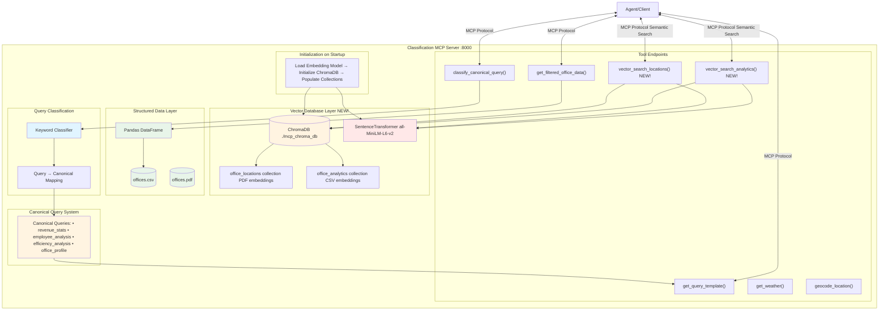
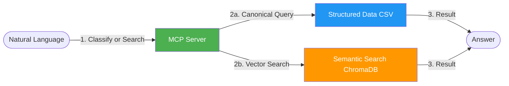
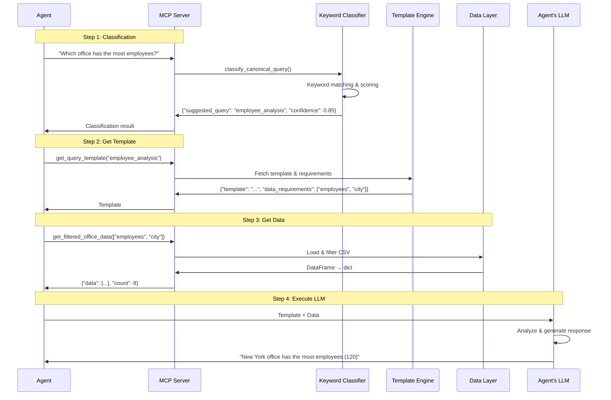
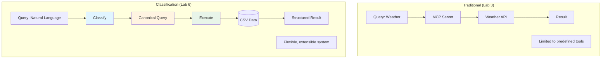
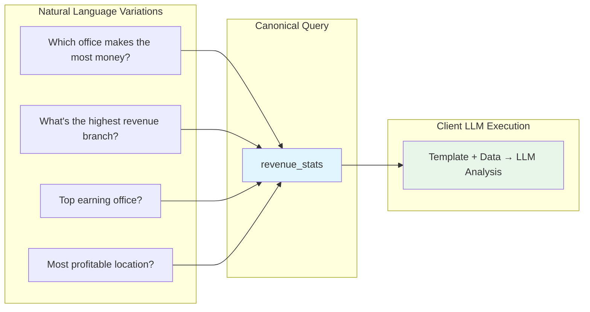
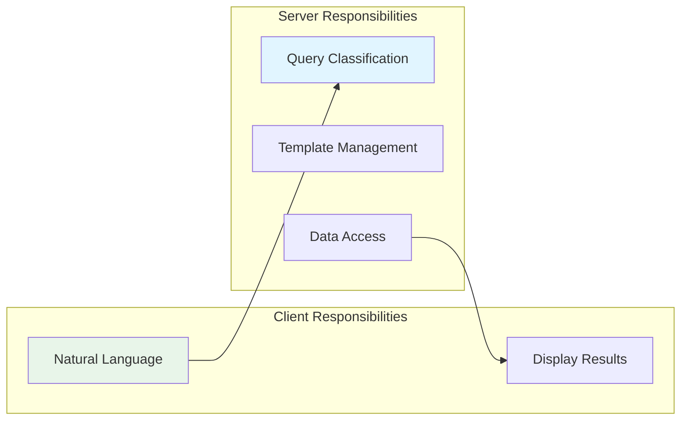

# Lab 6 Architecture: Building a Classification MCP Server

## Overview
Lab 6 transforms the MCP server to use canonical query classification and adds a vector database layer for semantic search. The server manages query interpretation, templates, and provides both structured (CSV) and semantic (vector) data access.

## Detailed Architecture Diagram



## Simple Architecture Diagram



## Classification Flow



## Component Details

### 1. Canonical Query System

**Defined Queries:**
```python
CANONICAL_QUERIES = {
    "revenue_stats": {
        "description": "Calculate revenue statistics",
        "example_queries": ["What's the average revenue?",
                           "Which office has the highest revenue?"]
    },
    "employee_analysis": {
        "description": "Analyze employee distribution",
        "example_queries": ["Which office has the most employees?"]
    },
    "efficiency_analysis": {
        "description": "Calculate revenue per employee",
        "example_queries": ["Which office is most efficient?"]
    },
    "growth_analysis": {
        "description": "Analyze office growth patterns by year",
        "parameters": [{"name": "year_threshold", "type": "int"}],
        "example_queries": ["What offices opened after 2014?"]
    },
    "office_profile": {
        "description": "Detailed profile of a specific office",
        "parameters": [{"name": "city", "type": "str"}],
        "example_queries": ["Tell me about the Chicago office"]
    }
}
```

### 2. Vector Database Layer (NEW in Lab 6!)

**Architecture:**
```python
# Server initialization populates vector database on startup
def _populate_vector_db():
    embed_model = SentenceTransformer("all-MiniLM-L6-v2")
    chroma_client = chromadb.PersistentClient(path="./mcp_chroma_db")

    # Two collections for different data sources
    locations_coll = chroma_client.get_or_create_collection("office_locations")
    analytics_coll = chroma_client.get_or_create_collection("office_analytics")

    # Populate from PDF (if empty)
    if locations_coll.count() == 0:
        pdf_lines = extract_lines_from_pdf("data/offices.pdf")
        for idx, line in enumerate(pdf_lines):
            embedding = embed_model.encode(line).tolist()
            locations_coll.add(
                ids=[f"pdf-{idx}"],
                embeddings=[embedding],
                documents=[line]
            )

    # Populate from CSV (if empty)
    if analytics_coll.count() == 0:
        df = pd.read_csv("data/offices.csv")
        for idx, row in df.iterrows():
            text = f"{row['city']} office with {row['employees']} employees..."
            embedding = embed_model.encode(text).tolist()
            analytics_coll.add(
                ids=[f"csv-{idx}"],
                embeddings=[embedding],
                documents=[text],
                metadatas={"city": row['city'], "employees": int(row['employees']), ...}
            )
```

**Vector Search Tools:**
```python
@mcp.tool
def vector_search_locations(query: str, top_k: int = 5) -> dict:
    """
    Semantic vector search for office locations using ChromaDB.
    Better than keyword matching for fuzzy queries like "HQ" or "headquarters".

    Returns: {"matches": list of dicts with document and metadata, "count": int}
    """
    embed_model = get_embed_model()
    locations_coll = get_chroma_collections()[0]

    query_embedding = embed_model.encode(query).tolist()
    results = locations_coll.query(
        query_embeddings=[query_embedding],
        n_results=top_k
    )
    return {"matches": results["documents"][0], "count": len(results["documents"][0])}

@mcp.tool
def vector_search_analytics(query: str, top_k: int = 5) -> dict:
    """
    Semantic vector search for office analytics.
    Enables semantic queries like "high revenue offices" or "large teams".

    Returns: {"matches": list of dicts with document and metadata, "count": int}
    """
    # Similar implementation for analytics collection
    ...
```

**Key Points:**
- **Initialization**: Vector DB populated on server startup (not on every query)
- **Two Collections**: Separate embeddings for PDF (locations) and CSV (analytics)
- **Semantic Search**: Uses cosine similarity for finding relevant documents
- **Metadata Storage**: CSV data includes structured metadata (city, employees, revenue)
- **Persistent Storage**: ChromaDB data persists at `./mcp_chroma_db`

### 3. Keyword-Based Classifier

```python
@mcp.tool()
def classify_canonical_query(user_query: str) -> dict:
    """
    Classify which canonical query best matches user intent.

    Uses keyword matching and scoring to determine:
    "Which office makes the most money?" → "revenue_stats"
    "How many branches do we have?" → "employee_analysis"

    Returns:
        {"suggested_query": str, "confidence": float,
         "alternatives": list, "reason": str}
    """
    user_lower = user_query.lower()
    scores = {}

    # Score each canonical query based on keyword overlap
    for query_name, config in CANONICAL_QUERIES.items():
        score = 0
        examples = config["example_queries"]

        # Check keyword matches against example queries
        for example in examples:
            example_words = set(example.lower().split())
            user_words = set(user_lower.split())
            overlap = len(example_words.intersection(user_words))
            if overlap > 0:
                score += overlap / len(example_words)

        scores[query_name] = score

    best_query = max(scores, key=scores.get)
    confidence = min(scores[best_query], 1.0)

    return {
        "suggested_query": best_query,
        "confidence": confidence,
        "alternatives": [...],
        "reason": f"Best keyword match with confidence {confidence:.2f}"
    }
```

### 4. Template and Data Tools

The server provides prompt templates and data rather than executing queries:

```python
@mcp.tool
def get_query_template(query_name: str, city: str = None,
                       year_threshold: int = None) -> dict:
    """
    Get the prompt template for a canonical query.

    Returns:
        {"template": str, "data_requirements": list,
         "parameters_used": dict}
    """
    config = CANONICAL_QUERIES[query_name]
    template = config["prompt_template"]

    # Template contains {data} placeholder for client substitution
    return {
        "template": template,
        "data_requirements": config["data_requirements"],
        "parameters_used": parameters
    }

@mcp.tool
def get_filtered_office_data(columns: list = None,
                             filters: dict = None) -> dict:
    """
    Get filtered office data for specific analysis.

    Returns:
        {"data": list, "count": int, "filters_applied": dict}
    """
    df = pd.read_csv("data/offices.csv")

    # Apply filters and column selection
    # Return data as list of dicts
    return {
        "data": df.to_dict(orient="records"),
        "count": len(df),
        "columns": list(df.columns)
    }
```

### 5. Canonical Query Structure

```python
CANONICAL_QUERIES = {
    "revenue_stats": {
        "description": "Calculate revenue statistics across all offices",
        "parameters": [],
        "data_requirements": ["revenue_million", "city"],
        "prompt_template": """You are a financial analyst...
Office Revenue Data:
{data}

Please calculate and report:
1. Which office has the highest revenue
2. Which office has the lowest revenue
3. Average revenue across all offices
4. Total revenue across all offices""",
        "example_queries": [
            "What's the average revenue?",
            "Which office has the highest revenue?"
        ]
    },
    # ... more canonical queries
}
```

## Classification vs. Traditional Approach



## Data Flow: Complete Pipeline

1. **Natural Language Input**:
   ```
   "Which office has the highest revenue?"
   ```

2. **Classification** (Keyword-based):
   ```
   Keyword matching → Score queries → "revenue_stats" (confidence: 0.85)
   ```

3. **Template Retrieval**:
   ```python
   template = get_query_template("revenue_stats")
   # Returns: {
   #   "template": "You are a financial analyst...",
   #   "data_requirements": ["revenue_million", "city"]
   # }
   ```

4. **Data Retrieval**:
   ```python
   data = get_filtered_office_data(columns=["revenue_million", "city"])
   # Returns: {"data": [{city: "New York", revenue_million: 85.5}, ...]}
   ```

5. **LLM Execution** (Client-side):
   ```python
   prompt = template.format(data=json.dumps(data))
   response = llm.invoke(prompt)
   # Returns: "New York office has the highest revenue: $85.5 million."
   ```

## Query Mapping Examples



## Architecture Benefits

### 1. Separation of Concerns


### 2. Extensibility
Add new canonical queries without changing client:
```python
# Server side only - add new query definition
CANONICAL_QUERIES["team_size_analysis"] = {
    "description": "Analyze team size distribution",
    "parameters": [],
    "data_requirements": ["employees", "city"],
    "prompt_template": """Analyze team sizes:
{data}

Provide insights on team size distribution and patterns.""",
    "example_queries": [
        "How big are our teams?",
        "Show me team size analysis"
    ]
}
```

### 3. Consistency
Templates ensure structured, predictable LLM responses:
```
Template structure:
- System prompt (role/context)
- Data placeholder {data}
- Specific instructions (what to calculate/report)
- Output format guidance
```

## Key Differences from Lab 3

| Aspect | Lab 3 (Tools) | Lab 6 (Classification + Vector DB) |
|--------|---------------|----------------------|
| Query Type | Tool names | Natural language |
| Processing | Direct execution | Classify → Template → Data → Execute |
| Data Source | External APIs | Local CSV + PDF (embedded) |
| Vector Database | None | ChromaDB with 2 collections |
| Semantic Search | None | Vector search for locations & analytics |
| Flexibility | Fixed tools | Extensible queries + semantic search |
| Complexity | Low | High |
| LLM Usage | None (in server) | Client-side (for analysis) |
| Classification | None | Keyword-based |
| Server Role | Execute tools | Classify + Provide templates/data + Vector search |
| Client Role | Call tools | Execute LLM with templates |

## Canonical Query Benefits

1. **Structured Queries**: Predefined, testable operations
2. **Data Validation**: Type-safe query parameters
3. **Performance**: Direct DataFrame operations
4. **Maintainability**: Clear query definitions
5. **Extensibility**: Easy to add new canonical queries
6. **Consistency**: Predictable response formats

## Implementation Patterns

### Pattern 1: Keyword Scoring
```python
def classify_canonical_query(user_query: str) -> dict:
    user_lower = user_query.lower()
    scores = {}

    for query_name, config in CANONICAL_QUERIES.items():
        score = 0
        # Score based on example query overlap
        for example in config["example_queries"]:
            example_words = set(example.lower().split())
            user_words = set(user_lower.split())
            overlap = len(example_words.intersection(user_words))
            if overlap > 0:
                score += overlap / len(example_words)

        scores[query_name] = score

    best_query = max(scores, key=scores.get)
    return {"suggested_query": best_query, "confidence": scores[best_query]}
```

### Pattern 2: Template with Parameters
```python
# Template has placeholders for both data and parameters
template = """Analyze offices opened after {year_threshold}.

Data: {data}

Provide growth insights..."""

# Server substitutes parameters, leaves {data} for client
formatted = template.format(year_threshold=2014)
# Client later substitutes {data} with actual office records
```

## Key Learning Points
- **Query Classification**: Natural language → Canonical form via keyword matching
- **Canonical Queries**: Predefined query definitions with templates
- **Template System**: Structured prompts for consistent LLM responses
- **Vector Database**: MCP server owns and manages ChromaDB for semantic search
- **Dual Data Sources**: Both PDF (locations) and CSV (analytics) embedded
- **Semantic Search**: Vector embeddings enable fuzzy matching beyond keywords
- **Separation of Concerns**: Server classifies & provides templates, client executes LLM
- **Data Requirements**: Templates specify what data columns are needed
- **Client-Side LLM**: LLM execution happens on client with server-provided templates
- **Extensibility**: Add new canonical queries by updating server config only
- **Startup Initialization**: Vector DB populated once on startup for performance

## Architecture Characteristics
- **Type**: Classification-based query system with vector database
- **Complexity**: High
- **Dependencies**: FastMCP, Pandas, ChromaDB, SentenceTransformers, pdfplumber, Ollama
- **Data Sources**: CSV files (structured) + PDF files (embedded)
- **Vector Database**: ChromaDB with persistent storage (`./mcp_chroma_db`)
- **Embedding Model**: SentenceTransformer (all-MiniLM-L6-v2)
- **Collections**: 2 (office_locations from PDF, office_analytics from CSV)
- **Latency**: ~1-2 seconds (keyword classification + template/data/vector retrieval)
- **Scalability**: Add queries without client changes
- **Flexibility**: Handles natural language variations + semantic search

## Use Cases
1. **Business Analytics**: Query structured business data
2. **Data Exploration**: Natural language data queries
3. **Reporting**: Standardized query responses
4. **Multi-client Systems**: One server, many clients
5. **Version Management**: Server handles query evolution

---

<p align="center">
**For educational use only by the attendees of our workshops.**
</p>

**(C) 2025 Tech Skills Transformations and Brent C. Laster - all rights reserved.**
