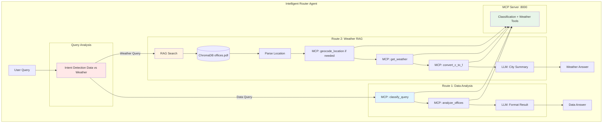
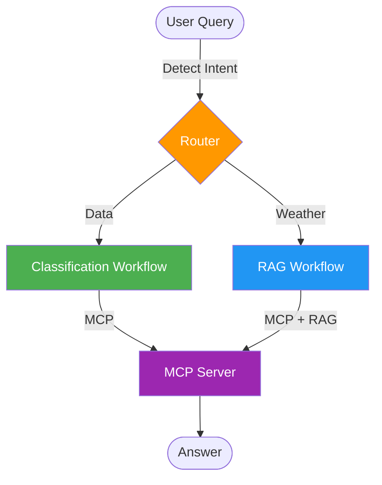
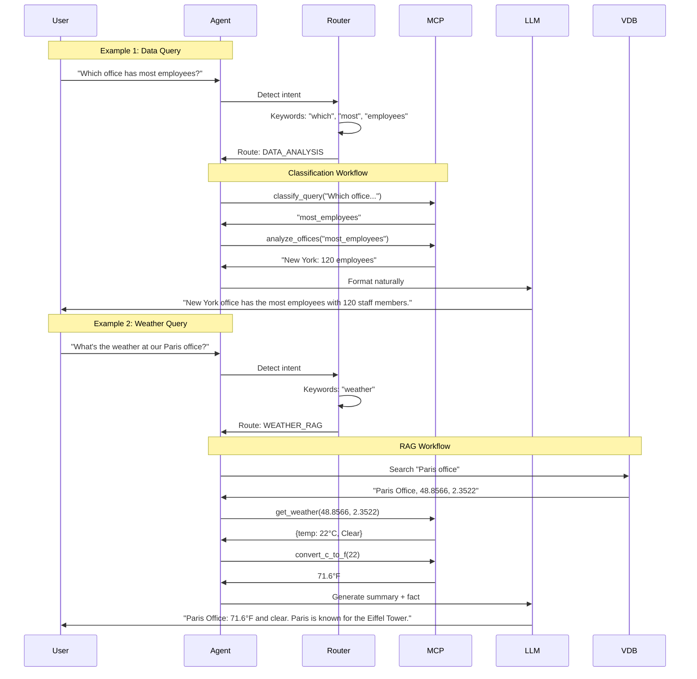
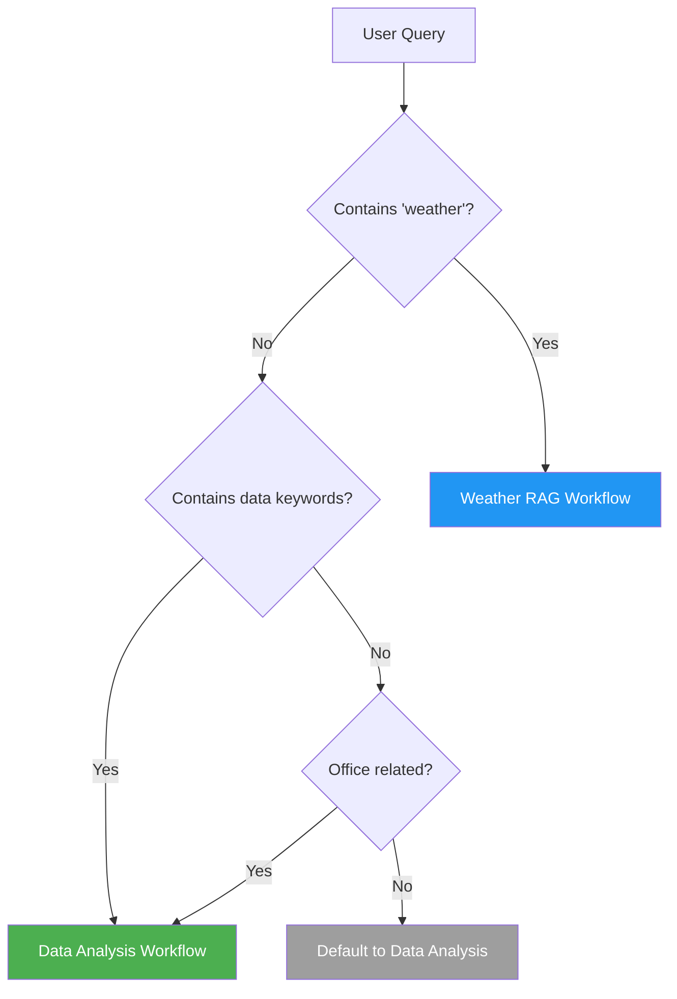
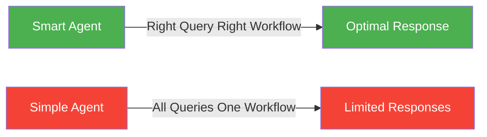

# Lab 7 Architecture: Building a Classification-Based RAG Agent

## Overview
Lab 7 combines RAG (Lab 5) with the classification MCP server (Lab 6), creating an intelligent agent that routes queries to either data analysis or weather workflows.

## Detailed Architecture Diagram



## Presentation Slide Diagram (Simple)



## Dual-Workflow Architecture



## Component Details

### 1. Intent Detection Router

```python
def detect_query_type(query: str) -> str:
    """
    Determine if query is about data analysis or weather.
    """
    data_keywords = [
        "revenue", "employees", "highest", "lowest",
        "average", "most", "which office", "how many"
    ]

    weather_keywords = [
        "weather", "temperature", "forecast",
        "conditions", "climate"
    ]

    query_lower = query.lower()

    if any(kw in query_lower for kw in weather_keywords):
        return "WEATHER_RAG"
    elif any(kw in query_lower for kw in data_keywords):
        return "DATA_ANALYSIS"
    else:
        # Default to data analysis for office-related queries
        return "DATA_ANALYSIS"
```

### 2. Classification Workflow (Data Queries)

```python
async def handle_data_query(query: str, mcp_client):
    """
    Route 1: Classification-based data analysis.
    """
    # Step 1: Classify to canonical query
    canonical = await mcp_client.call_tool(
        "classify_query",
        {"natural_query": query}
    )

    # Step 2: Execute canonical query
    result = await mcp_client.call_tool(
        "analyze_offices",
        {"canonical_query": canonical}
    )

    # Step 3: Format with LLM
    llm = ChatOllama(model="llama3.2")
    response = llm.invoke([
        {"role": "system", "content": "Format data naturally"},
        {"role": "user", "content": f"Data: {result}"}
    ])

    return response.content
```

### 3. RAG Workflow (Weather Queries)

```python
async def handle_weather_query(query: str, mcp_client):
    """
    Route 2: RAG-based weather lookup.
    """
    # Step 1: RAG search
    rag_results = rag_search(query, embed_model, vector_db)

    # Step 2: Extract location (coordinates or city name)
    coords = find_coords(rag_results)  # Try to find explicit lat/lon

    if not coords:
        # Fallback: extract city name and geocode via MCP
        city_name = find_city_state(rag_results) or find_city_country(rag_results) or guess_city(rag_results)
        if city_name:
            geo_result = await mcp_client.call_tool("geocode_location", {"name": city_name})
            coords = (geo_result["latitude"], geo_result["longitude"])

    # Step 3: Get weather via MCP
    lat, lon = coords
    weather = await mcp_client.call_tool("get_weather", {"lat": lat, "lon": lon})
    temp_f = await mcp_client.call_tool("convert_c_to_f", {"c": weather["temperature"]})

    # Step 4: Generate summary with city fact
    llm = ChatOllama(model="llama3.2")
    response = llm.invoke([
        {"role": "system", "content": "Create summary with city fact"},
        {"role": "user", "content": f"Office: {rag_results[0]}, Weather: {temp_f}°F"}
    ])

    return response.content
```

## Workflow Comparison

```mermaid
graph TB
    subgraph "Data Analysis Workflow"
        D1[Natural Language Query]
        D2[Classify to Canonical]
        D3[Execute on CSV Data]
        D4[Format Result]
        D5[Structured Answer]

        D1 --> D2 --> D3 --> D4 --> D5
    end

    subgraph "Weather RAG Workflow"
        W1[Natural Language Query]
        W2[RAG Search Vector DB]
        W3[Extract Location]
        W4[Get Weather + Convert]
        W5[Generate Summary]
        W6[Rich Answer]

        W1 --> W2 --> W3 --> W4 --> W5 --> W6
    end

    style D3 fill:#e1f5ff
    style W2 fill:#fff4e1
    style D5 fill:#e8f5e9
    style W6 fill:#e8f5e9
```



## Query Routing Decision Tree



## Data Flow Examples

### Example 1: Data Query
```
Input: "Which office has the highest revenue?"

Route Detection: [revenue, highest] → DATA_ANALYSIS

Workflow:
  1. classify_query("Which office...") → "highest_revenue"
  2. analyze_offices("highest_revenue") → "New York: $85.5M"
  3. LLM format → "New York office has the highest revenue at $85.5 million."

Output: Formatted data answer
```

### Example 2: Weather Query (with explicit coordinates)
```
Input: "What's the weather at our Paris office?"

Route Detection: [weather] → WEATHER_RAG

Workflow:
  1. RAG search("Paris office") → "Paris Office, 48.8566, 2.3522..."
  2. Extract coords → (48.8566, 2.3522) [found in text]
  3. get_weather(48.8566, 2.3522) → {temp: 22°C, Clear}
  4. convert_c_to_f(22) → 71.6°F
  5. LLM summary → "Paris Office, currently 71.6°F and clear.
                     The Champs-Élysées is a famous Paris landmark."

Output: Rich weather + context answer
```

### Example 2b: Weather Query (with geocoding fallback)
```
Input: "What's the weather in Austin?"

Route Detection: [weather] → WEATHER_RAG

Workflow:
  1. RAG search("Austin") → "Austin Office, Texas, opened 2015..."
  2. Extract coords → None [no explicit coordinates in text]
  3. Extract city → "Austin, TX"
  4. geocode_location("Austin, TX") → {lat: 30.2672, lon: -97.7431}
  5. get_weather(30.2672, -97.7431) → {temp: 28°C, Partly cloudy}
  6. convert_c_to_f(28) → 82.4°F
  7. LLM summary → "Austin Office, currently 82.4°F and partly cloudy.
                     Austin is known as the Live Music Capital."

Output: Rich weather + context answer
```

### Example 3: Ambiguous Query
```
Input: "Tell me about the Chicago office"

Route Detection: [office] → DATA_ANALYSIS (default for office queries)

Workflow:
  1. Could match "compare_chicago" canonical query
  2. OR RAG search if no canonical match
  3. Returns office profile data

Fallback: If classification fails, RAG workflow provides context
```

## Unified MCP Server

```mermaid
graph TB
    subgraph "Unified MCP Server :8000"
        subgraph "Classification Tools"
            T1[@mcp.tool classify_query]
            T2[@mcp.tool analyze_offices]
        end

        subgraph "Weather Tools"
            T3[@mcp.tool geocode_location]
            T4[@mcp.tool get_weather]
            T5[@mcp.tool convert_c_to_f]
        end

        subgraph "Data Sources"
            CSV[(offices.csv)]
            API[Open-Meteo API]
        end

        T1 --> LLM[LLM Classifier]
        T2 --> CSV
        T3 --> API
        T4 --> API
    end

    Agent[RAG Agent] <-->|MCP Protocol| T1
    Agent <-->|MCP Protocol| T2
    Agent <-->|MCP Protocol| T3
    Agent <-->|MCP Protocol| T4
    Agent <-->|MCP Protocol| T5

    style T1 fill:#e1f5ff
    style T2 fill:#e1f5ff
    style T3 fill:#fff4e1
    style T4 fill:#fff4e1
    style T5 fill:#fff4e1
```

## Key Advantages

### 1. Intelligent Routing


### 2. Best of Both Worlds
| Feature | Classification | RAG | Lab 7 |
|---------|---------------|-----|-------|
| Structured Data | ✓ | ✗ | ✓ |
| Unstructured Docs | ✗ | ✓ | ✓ |
| Consistency | ✓ | ~ | ✓ |
| Flexibility | ~ | ✓ | ✓ |
| Speed | Fast | Medium | Optimized |

### 3. Fallback Mechanisms
```python
try:
    # Try classification workflow
    result = await classification_workflow(query)
except Exception:
    # Fallback to RAG
    result = await rag_workflow(query)
```

## Key Differences from Previous Labs

| Aspect | Lab 5 | Lab 6 | Lab 7 |
|--------|-------|-------|-------|
| Workflows | 1 (RAG) | 1 (Classification) | 2 (Dual) |
| Routing | None | None | Intelligent |
| Data Sources | PDF only | CSV only | Both |
| Query Types | Weather | Data analysis | Both |
| Flexibility | Medium | Medium | High |
| Complexity | High | Medium | Highest |

## Key Learning Points
- **Workflow Routing**: Intelligent query type detection
- **Dual Architecture**: Multiple workflows in one agent
- **Fallback Strategies**: Handle classification failures
- **MCP Unification**: One server, multiple tool types
- **Query Optimization**: Use appropriate workflow for query type
- **Scalability**: Easy to add new workflows
- **Separation**: Clear workflow boundaries

## Architecture Characteristics
- **Type**: Intelligent multi-workflow agent
- **Complexity**: High
- **Dependencies**: All previous labs combined
- **Workflows**: 2 (Classification + RAG)
- **Routing**: Keyword-based intent detection
- **Latency**: 2-10 seconds (workflow-dependent)
- **LLM Calls**: 1-3 per query
- **Flexibility**: Handles diverse query types

## Use Cases
1. **Business Intelligence**: Data + context queries
2. **Multi-domain Agents**: Different workflows for different domains
3. **Hybrid Systems**: Structured + unstructured data
4. **Intelligent Assistants**: Route to appropriate processing
5. **Production Agents**: Robust fallback handling

---

**For training purposes only. (C) 2025 Tech Skills Transformations and Brent C. Laster - all rights reserved.**
