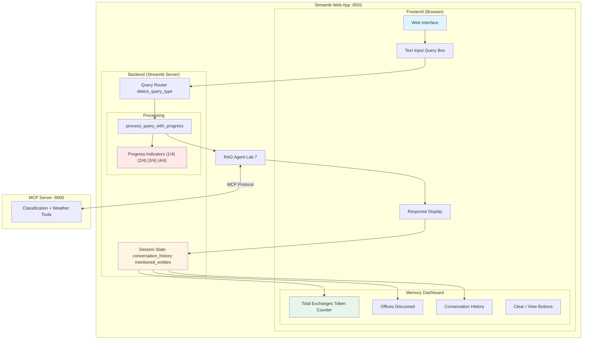
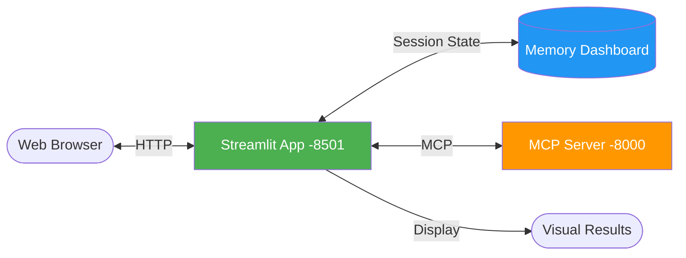
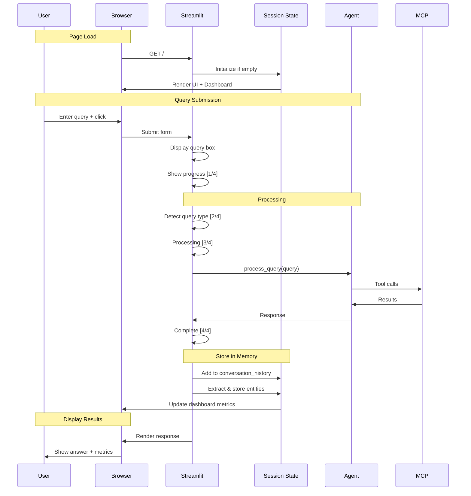
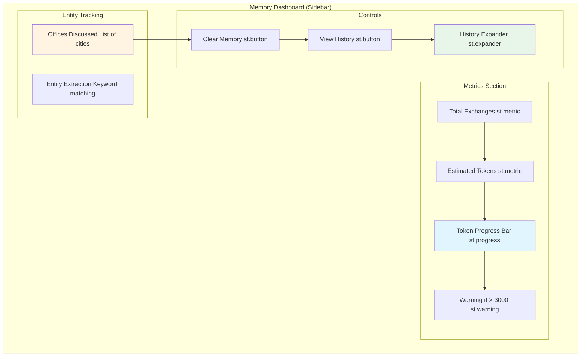
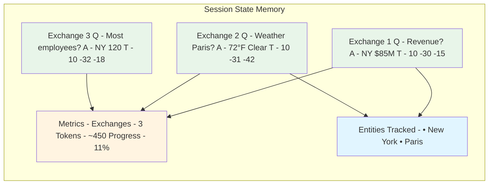
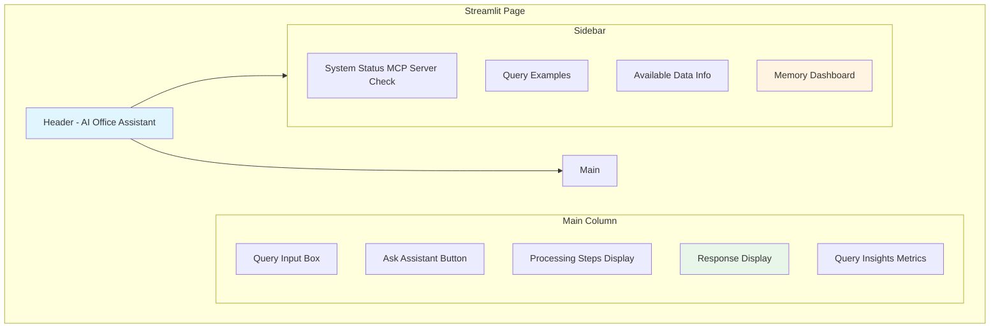

# Lab 8 Architecture: Creating a Streamlit Web Application

## Overview
Lab 8 wraps the Classification RAG Agent (Lab 7) in a modern web interface using Streamlit, adding a visual memory dashboard and user-friendly interaction.

## Detailed Architecture Diagram



## Presentation Slide Diagram (Simple)



## Streamlit Session State Architecture

```mermaid
graph TB
    subgraph "Session State (In-Memory)"
        State[st.session_state]

        subgraph "Conversation Data"
            History["conversation_history - List of exchanges"]
            Entities["mentioned_entities - {'offices' - set, 'queries' - list}"]
        end

        subgraph "UI State"
            ShowHistory["show_history - bool"]
        end

        State --> History
        State --> Entities
        State --> ShowHistory
    end

    subgraph "Memory Calculations"
        TotalEx[Total Exchanges = len(history)]
        Tokens[Estimated Tokens = chars / 4]
        Progress[Token Progress = tokens / max_tokens]
    end

    History --> TotalEx
    History --> Tokens
    Tokens --> Progress

    style State fill:#e1f5ff
    style History fill:#fff4e1
    style Tokens fill:#e8f5e9
```

## User Interaction Flow



## Memory Dashboard Components



## Component Details

### 1. Session State Initialization

```python
# In main() function
if 'conversation_history' not in st.session_state:
    st.session_state.conversation_history = []

if 'mentioned_entities' not in st.session_state:
    st.session_state.mentioned_entities = {
        'offices': set(),
        'queries': []
    }
```

### 2. Progress Indicator System

```python
async def process_query_with_progress(user_query):
    # Step 1: Query Analysis
    step1.markdown('[1/4] Analyzing query intent...')

    # Step 2: Route Detection
    is_weather = any(kw in user_query.lower()
                     for kw in weather_keywords)
    step2.markdown('[2/4] Weather/Data query detected...')

    # Step 3: Processing
    step3.markdown('[3/4] Processing with AI agent...')
    result = await process_query(user_query)

    # Step 4: Complete
    step4.markdown('[4/4] Analysis complete!')

    return result
```

### 3. Memory Metrics Calculation

```python
# Calculate totals
total_exchanges = len(st.session_state.conversation_history)
st.metric("Total Exchanges", total_exchanges)

# Token estimation (rough: chars / 4)
total_chars = sum(
    len(ex['query']) + len(ex.get('response', ''))
    for ex in st.session_state.conversation_history
)
estimated_tokens = int(total_chars / 4)
st.metric("Estimated Tokens", f"{estimated_tokens:,}")

# Progress bar
max_tokens = 4000
token_percentage = (estimated_tokens / max_tokens) * 100
st.progress(min(token_percentage / 100, 1.0))

# Warning
if estimated_tokens > 3000:
    st.warning("Memory nearly full - consider clearing")
```

### 4. Entity Extraction

```python
# Define office names
office_names = [
    'Chicago', 'New York', 'San Francisco', 'Austin',
    'Atlanta', 'Boston', 'Denver', 'Seattle', 'Miami', 'Los Angeles'
]

# Extract from query and response
for office in office_names:
    if (office.lower() in user_query.lower() or
        office.lower() in result.lower()):
        st.session_state.mentioned_entities['offices'].add(office)

# Display tracked offices
if st.session_state.mentioned_entities['offices']:
    st.subheader("Offices Discussed")
    for office in sorted(st.session_state.mentioned_entities['offices']):
        st.text(f"• {office}")
```

### 5. Conversation Storage

```python
# After successful query
exchange = {
    'query': user_query,
    'response': result,
    'timestamp': datetime.now().strftime("%H:%M:%S")
}
st.session_state.conversation_history.append(exchange)
```

## Memory Visualization



## UI Layout Structure



## Key Features

### 1. Real-Time Processing Indicators
Shows 4-step process as it happens:
1. Analyzing query intent
2. Route detection (weather vs data)
3. AI processing
4. Analysis complete

### 2. MCP Server Status Check
```python
try:
    response = requests.get("http://127.0.0.1:8000/", timeout=2)
    if response.status_code in [200, 404, 405]:
        st.success("MCP Server Connected")
    else:
        st.warning("MCP Server Status Unknown")
except requests.exceptions.ConnectionError:
    st.error("MCP Server Offline")
    st.warning("Start server: python mcp_server_canonical.py")
```

### 3. Custom CSS Styling
```python
st.markdown("""
<style>
    .main-header { text-align: center; color: #1f77b4; }
    .query-box { background-color: #f0f2f6; padding: 1rem; }
    .result-box { background-color: #e8f4fd; padding: 1rem; }
    .processing-step { background-color: #fff3cd; padding: 0.5rem; }
</style>
""", unsafe_allow_html=True)
```

### 4. Query Insights Display
```python
col1, col2, col3 = st.columns(3)
with col1:
    st.metric("Query Type", "Data Analysis")
with col2:
    st.metric("Processing Time", "< 5s")
with col3:
    st.metric("Confidence", "High")
```

## Data Flow: Complete User Journey

1. **User Opens Browser** → Navigate to `http://localhost:8501`
2. **Page Load** → Streamlit initializes session state
3. **Dashboard Display** → Shows 0 exchanges, empty entity list
4. **User Enters Query** → "Which office has highest revenue?"
5. **Processing Steps** → Visual indicators [1/4] → [2/4] → [3/4] → [4/4]
6. **Agent Processing** → Calls Lab 7 agent → MCP tools
7. **Response Display** → Formatted answer in styled box
8. **Memory Update** → Add to conversation_history, extract entities
9. **Dashboard Update** → Metrics refresh (1 exchange, ~100 tokens, NY tracked)
10. **User Continues** → More queries build up memory

## Key Differences from Lab 7

| Aspect | Lab 7 (CLI) | Lab 8 (Web) |
|--------|-------------|-------------|
| Interface | Command-line | Web browser |
| Interaction | Text-based | Visual/Interactive |
| Progress | Console logs | Visual indicators |
| Memory | None | Dashboard with metrics |
| Accessibility | Technical users | All users |
| Deployment | Local only | Can deploy to cloud |
| UX | Basic | Enhanced with styling |

## Key Learning Points
- **Streamlit Framework**: Rapid web app development
- **Session State**: Maintaining state between reruns
- **Progressive UI**: Visual feedback during processing
- **Memory Dashboard**: Visualizing agent memory
- **Entity Tracking**: Automatic extraction and display
- **Token Management**: Estimating and displaying usage
- **Responsive Design**: Sidebar + main column layout
- **Status Monitoring**: Server connection checks

## Architecture Characteristics
- **Type**: Web application (client-server)
- **Framework**: Streamlit
- **Port**: 8501 (Streamlit), 8000 (MCP)
- **State**: Session-based (in-memory)
- **Persistence**: None (resets on page reload)
- **Scalability**: Single user per session
- **Deployment**: Local or cloud (Hugging Face Spaces)

## Benefits Over CLI

1. **Visual Interface**: Charts, metrics, colored indicators
2. **User-Friendly**: No command-line knowledge needed
3. **Memory Visibility**: Dashboard shows what agent remembers
4. **Status Feedback**: Server connection, processing steps
5. **Example Guidance**: Built-in query examples
6. **Interactive**: Buttons, expandable sections
7. **Shareable**: Can deploy for team use
8. **Professional**: Clean, branded interface

## Deployment Considerations

- **Local**: `streamlit run streamlit_app.py`
- **Cloud**: Can deploy to Hugging Face Spaces, Streamlit Cloud, etc.
- **MCP Server**: Must be running for full functionality
- **Fallback**: `app.py` has embedded logic for cloud deployment
- **State**: Session state lost on page refresh (not persistent)
