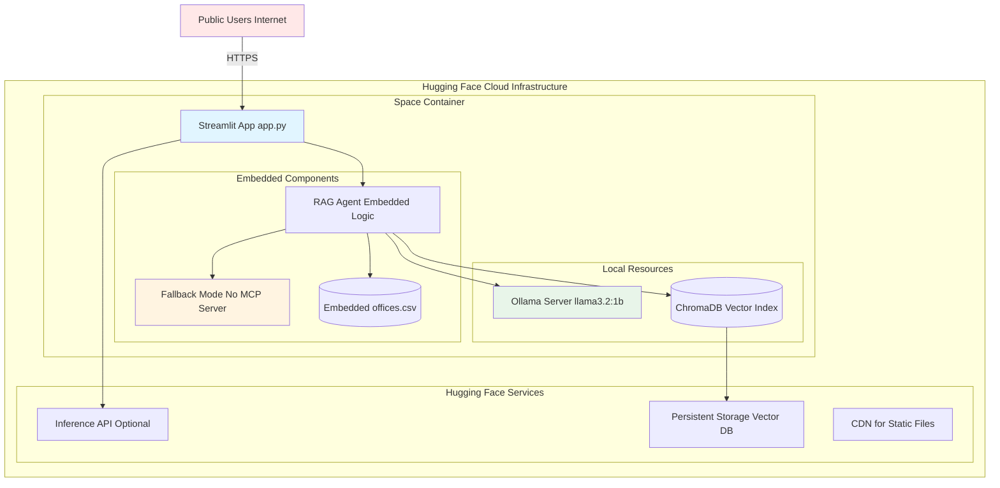
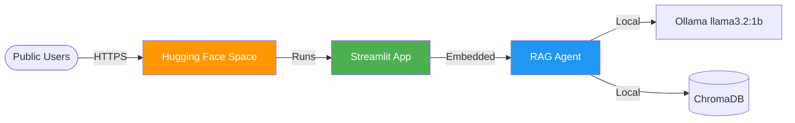
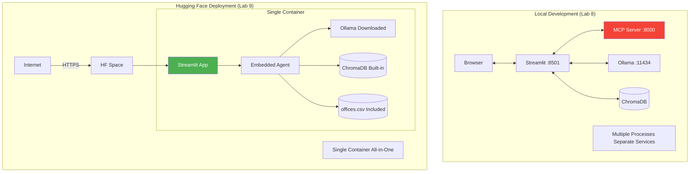
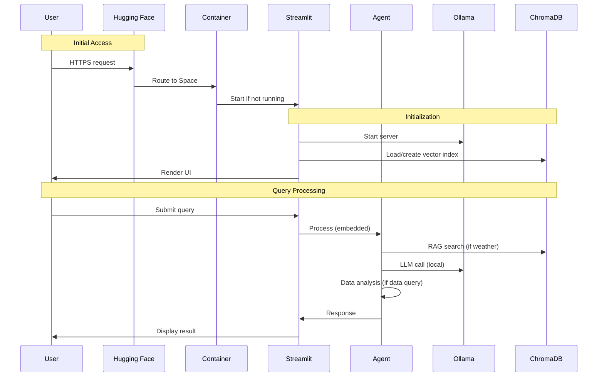
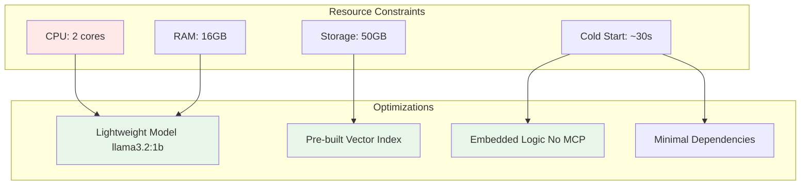
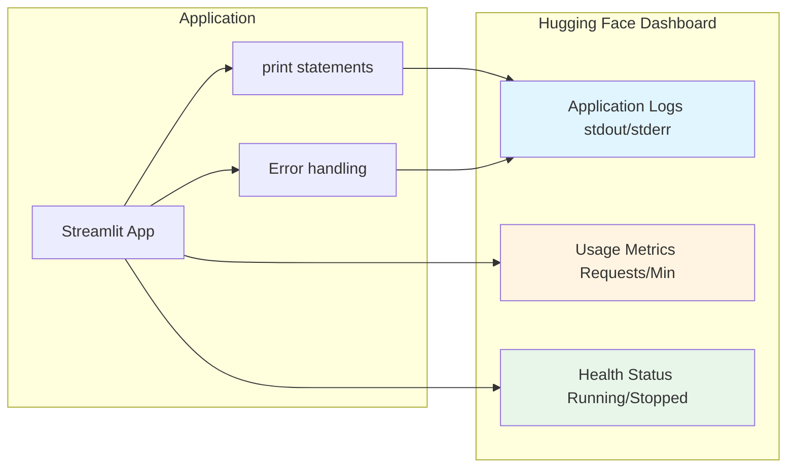

# Lab 9 Architecture: Deploying to Hugging Face Spaces

## Overview
Lab 9 focuses on deploying the Streamlit app to Hugging Face Spaces, making the AI assistant publicly accessible with cloud-based inference.

## Detailed Architecture Diagram



## Presentation Slide Diagram (Simple)



## Deployment Architecture Comparison



## Component Details

### 1. Hugging Face Space Configuration

**README.md Header:**
```yaml
---
title: AI Office Assistant
emoji: 📊
colorFrom: blue
colorTo: green
sdk: streamlit
sdk_version: "1.28.0"
app_file: app.py
pinned: false
python_version: "3.10"
---
```

### 2. Dockerfile for Hugging Face

```dockerfile
FROM python:3.10-slim

# Install system dependencies
RUN apt-get update && apt-get install -y \
    curl \
    && rm -rf /var/lib/apt/lists/*

# Set working directory
WORKDIR /app

# Copy application files
COPY . .

# Install Python dependencies
RUN pip install --no-cache-dir -r requirements.txt

# Download Ollama
RUN curl -L https://ollama.ai/install.sh | sh

# Pull llama3.2:1b model
RUN ollama pull llama3.2:1b

# Expose Streamlit port
EXPOSE 7860

# Start script
CMD ["sh", "start_huggingface_space.py"]
```

### 3. Embedded Agent (app.py)

```python
# app.py - Optimized for Hugging Face Spaces

# Embedded logic - no MCP server needed
def analyze_offices_embedded(canonical_query: str, df) -> str:
    """Direct execution without MCP"""
    if canonical_query == "highest_revenue":
        idx = df["revenue_million"].idxmax()
        return f"{df.loc[idx, 'city']}: ${df.loc[idx, 'revenue_million']}M"
    # ... more queries

def classify_query_embedded(query: str) -> str:
    """LLM classification without MCP"""
    llm = ChatOllama(model="llama3.2:1b", temperature=0)
    # Direct classification logic
    return canonical_query

# Use embedded functions instead of MCP calls
result = analyze_offices_embedded(canonical, df)
```

### 4. Startup Script

```python
# start_huggingface_space.py

import subprocess
import time
import os

# Start Ollama in background
ollama_process = subprocess.Popen(["ollama", "serve"])
time.sleep(5)  # Wait for Ollama to start

# Ensure model is available
subprocess.run(["ollama", "pull", "llama3.2:1b"])

# Index data if needed
if not os.path.exists("chroma_db"):
    subprocess.run(["python", "tools/index_pdf.py"])

# Start Streamlit
subprocess.run(["streamlit", "run", "app.py", "--server.port=7860"])
```

## Data Flow in Cloud Environment



## Key Modifications for Cloud Deployment

### 1. Remove MCP Server Dependency
```python
# Local (Lab 8):
async with Client(MCP_ENDPOINT) as mcp:
    result = await mcp.call_tool("analyze_offices", args)

# Cloud (Lab 9):
result = analyze_offices_embedded(canonical_query, df)
```

### 2. Lightweight Model
```python
# Local: Can use larger models
OLLAMA_MODEL = "llama3.2"  # 3B parameters

# Cloud: Use smaller model
OLLAMA_MODEL = "llama3.2:1b"  # 1B parameters - faster, less memory
```

### 3. Included Data Files
```
/app/
  ├── app.py
  ├── data/
  │   └── offices.csv        # Included in deployment
  ├── chroma_db/             # Pre-built or built on startup
  └── requirements.txt
```

### 4. Environment Detection
```python
def is_huggingface_space():
    return os.environ.get("SPACE_ID") is not None

if is_huggingface_space():
    # Use embedded logic
    use_mcp = False
else:
    # Try to connect to MCP server
    use_mcp = check_mcp_available()
```

## Resource Optimization



## Deployment Process


## File Structure for Deployment

```
huggingface-space/
├── README.md                 # HF Space config
├── Dockerfile               # Container definition
├── requirements.txt         # Python dependencies
├── app.py                   # Main Streamlit app (embedded logic)
├── start_huggingface_space.py  # Startup script
├── data/
│   └── offices.csv         # Office data
├── tools/
│   └── index_pdf.py        # Vector indexing
└── docs/
    └── offices.pdf         # Source document
```

## Requirements.txt Optimization

```txt
# Minimal dependencies for cloud deployment
streamlit==1.28.0
pandas==2.0.3
langchain-ollama==0.1.0
chromadb==0.4.15
sentence-transformers==2.2.2
requests==2.31.0

# Note: Reduced from full local requirements
# Removed: fastmcp (embedded logic instead)
```

## Monitoring and Logs



## Key Differences from Lab 8

| Aspect | Lab 8 (Local) | Lab 9 (Cloud) |
|--------|---------------|---------------|
| Deployment | Local machine | Hugging Face Cloud |
| MCP Server | Required (:8000) | Embedded in app |
| Model | llama3.2 (3B) | llama3.2:1b (1B) |
| Access | localhost:8501 | Public URL |
| Persistence | Local disk | HF persistent storage |
| Scalability | Single user | Multiple users |
| Resources | Your hardware | HF allocated resources |
| Cold Start | Instant | ~30 seconds |

## Key Learning Points
- **Cloud Deployment**: Moving from local to cloud
- **Container Packaging**: Docker for reproducible environments
- **Resource Optimization**: Smaller models, embedded logic
- **Public Access**: Sharing apps with the world
- **Serverless Considerations**: Cold starts, resource limits
- **Embedded vs Distributed**: When to embed vs separate services
- **Configuration Management**: Environment-specific settings

## Architecture Characteristics
- **Type**: Cloud-hosted web application
- **Platform**: Hugging Face Spaces
- **Container**: Docker-based
- **Model**: Ollama llama3.2:1b (local to container)
- **Public**: Yes (shareable URL)
- **Persistence**: HF storage for vector DB
- **Scalability**: HF handles multiple concurrent users
- **Cost**: Free tier available

## Benefits

1. **Public Access**: Anyone can use the app
2. **No Setup**: Users don't need to install anything
3. **Shareable**: Easy to share URL
4. **Persistent**: App stays running
5. **Professional**: Custom domain possible
6. **Free Hosting**: HF provides free tier
7. **CI/CD**: Auto-deploy on git push
8. **Monitoring**: Built-in logs and metrics

## Challenges & Solutions

| Challenge | Solution |
|-----------|----------|
| Resource limits | Use smaller model (1B params) |
| Cold starts | Optimize startup script |
| No MCP server | Embed logic directly |
| Network latency | Cache vector index |
| Cost concerns | Use free tier, optimize queries |
| Debugging | Comprehensive logging |

## Production Considerations

1. **Error Handling**: Robust fallbacks for API failures
2. **Rate Limiting**: Prevent abuse
3. **Caching**: Cache embeddings, reduce computation
4. **Monitoring**: Track errors and usage
5. **Security**: No sensitive data in public space
6. **Performance**: Optimize for cold starts
7. **Documentation**: Clear README for users
