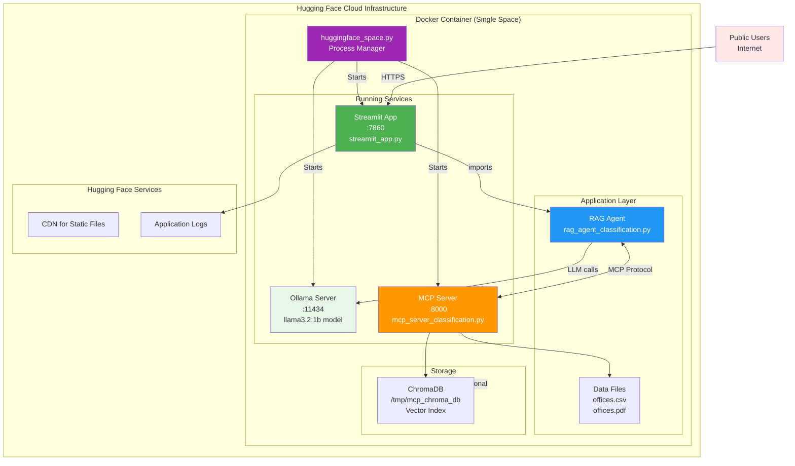
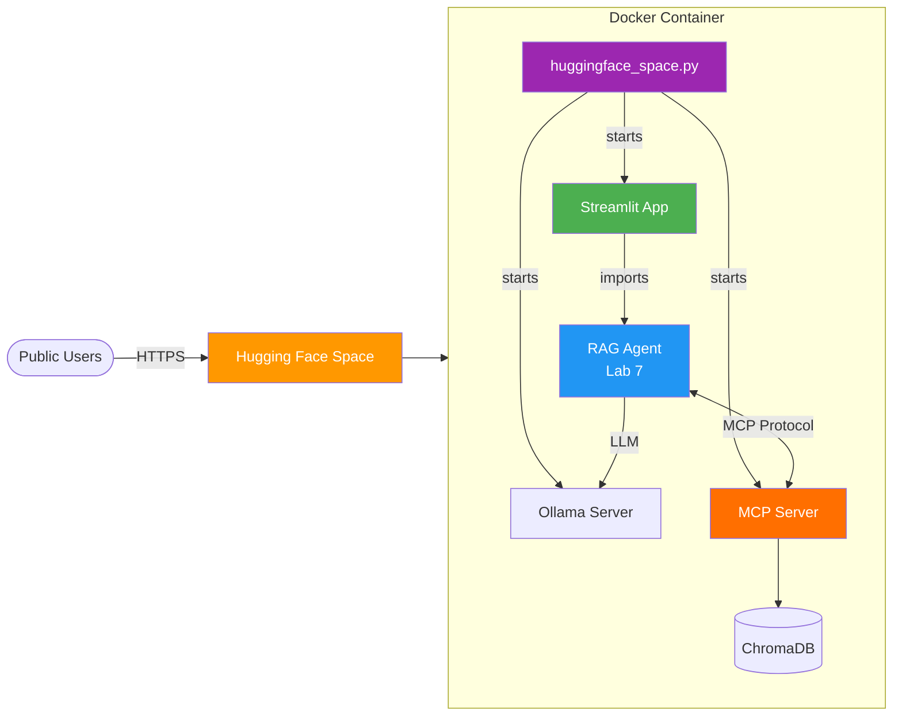
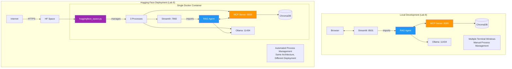
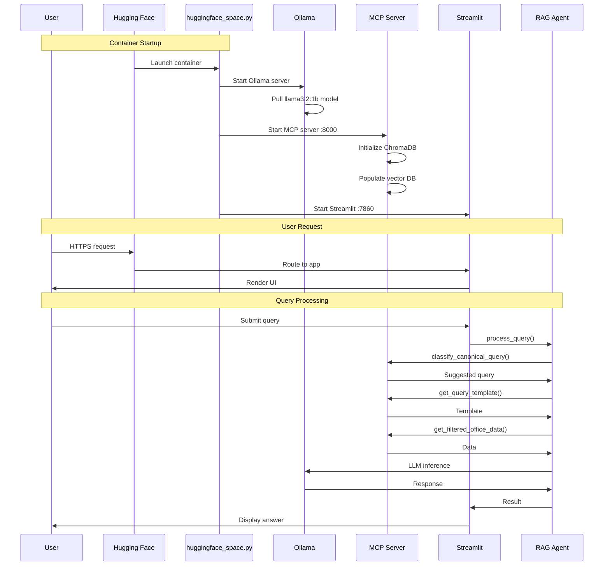
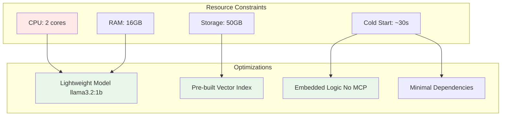
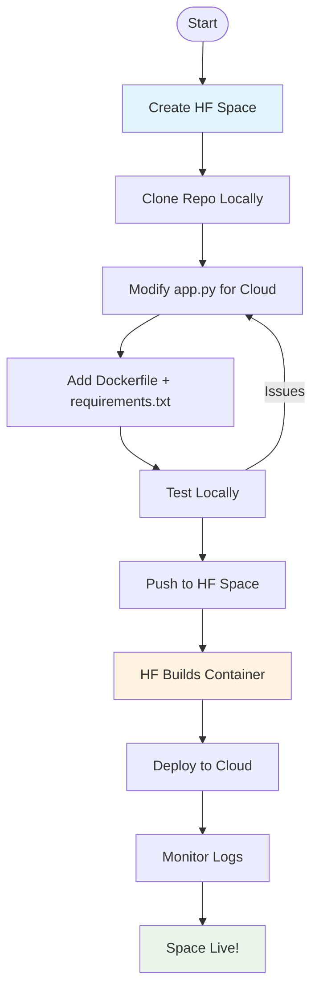
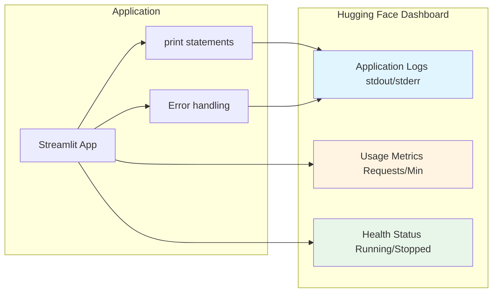

# Lab 9 Architecture: Deploying to Hugging Face Spaces

## Overview
Lab 9 deploys the **complete Lab 8 architecture** to Hugging Face Spaces - including the Streamlit app, RAG agent, MCP server, and Ollama - all running in a single Docker container. This makes the full AI assistant publicly accessible with the same capabilities as local development.

## Detailed Architecture Diagram



## Simple Architecture Diagram



## Deployment Architecture Comparison



## Component Details

### 1. Hugging Face Space Configuration

**README.md Header:**
```yaml
---
title: AI Office Assistant
emoji: 🏢
colorFrom: blue
colorTo: green
sdk: docker
sdk_version: 1.40.0
app_file: streamlit_app.py
pinned: false
license: mit
---
```

### 2. Dockerfile for Hugging Face

```dockerfile
FROM python:3.11-slim

# Install system dependencies (Ollama, build tools)
RUN apt-get update && apt-get install -y \
    curl \
    build-essential \
    && rm -rf /var/lib/apt/lists/*

# Install Ollama
RUN curl -fsSL https://ollama.com/install.sh | sh

# Set working directory
WORKDIR /app

# Copy application files
COPY . .

# Create writable directories for ChromaDB
RUN mkdir -p /tmp/mcp_chroma_db && \
    chmod -R 777 /tmp/mcp_chroma_db

# Install Python dependencies
RUN pip install --no-cache-dir -r requirements.txt

# Expose Streamlit port (HF Spaces uses 7860)
EXPOSE 7860

# Start script runs Ollama, MCP server, and Streamlit
CMD ["python3", "huggingface_space.py"]
```

### 3. Process Manager (huggingface_space.py)

```python
# huggingface_space.py - Manages all services

class ProcessManager:
    def start_ollama(self):
        """Start Ollama and pull llama3.2:1b model"""
        self.ollama_process = subprocess.Popen(["ollama", "serve"])
        time.sleep(5)
        subprocess.run(["ollama", "pull", "llama3.2:1b"])

    def start_mcp_server(self):
        """Start MCP classification server on :8000"""
        self.mcp_process = subprocess.Popen(
            ["python3", "mcp_server_classification.py"]
        )
        self.wait_for_mcp_server()

    def start_streamlit_app(self):
        """Start Streamlit app on :7860"""
        cmd = [
            "python3", "-m", "streamlit", "run",
            "streamlit_app.py",
            "--server.port", "7860",
            "--server.address", "0.0.0.0"
        ]
        self.streamlit_process = subprocess.Popen(cmd)

# Main startup
manager = ProcessManager()
manager.start_ollama()      # 1. Start Ollama
manager.start_mcp_server()  # 2. Start MCP Server
manager.start_streamlit_app()  # 3. Start Streamlit
```

### 4. Application Stack

The deployment uses the **same code as Lab 8**:
- **streamlit_app.py**: Web UI (unchanged)
- **rag_agent_classification.py**: RAG agent with classification (unchanged)
- **mcp_server_classification.py**: MCP server with tools (unchanged)

**Key Point**: The architecture is identical to local development - we just containerized it!

## Data Flow in Cloud Environment



## Key Modifications for Cloud Deployment

### 1. Process Management
```python
# Local (Lab 8): Manual process management
# Terminal 1: python mcp_server_classification.py
# Terminal 2: streamlit run streamlit_app.py

# Cloud (Lab 9): Automated process management
# huggingface_space.py manages all three:
manager.start_ollama()      # Background process
manager.start_mcp_server()  # Background process
manager.start_streamlit_app()  # Foreground process
```

### 2. Lightweight Model
```python
# Local: Can use larger models
OLLAMA_MODEL = "llama3.2"  # 3B parameters

# Cloud: Use smaller model for faster startup
OLLAMA_MODEL = "llama3.2:1b"  # 1B parameters
```

### 3. ChromaDB Path
```python
# Local (Lab 8): Current directory
CHROMA_PATH = Path("./mcp_chroma_db")

# Cloud (Lab 9): Temp directory (writable in container)
CHROMA_PATH = Path("/tmp/mcp_chroma_db")
```

### 4. Port Configuration
```python
# Local (Lab 8):
# - Streamlit: 8501 (default)
# - MCP Server: 8000
# - Ollama: 11434 (default)

# Cloud (Lab 9):
# - Streamlit: 7860 (HF Spaces requirement)
# - MCP Server: 8000 (same)
# - Ollama: 11434 (same)
```

## Resource Optimization



## Deployment Process



## File Structure for Deployment

```
huggingface-space/
├── README.md                        # HF Space config (sdk: docker)
├── Dockerfile                       # Container definition
├── Dockerfile.hf                    # HF-specific Dockerfile
├── requirements.txt                 # Python dependencies
├── huggingface_space.py            # Process manager (starts all services)
├── streamlit_app.py                # Streamlit UI (from Lab 8)
├── rag_agent_classification.py     # RAG agent (from Lab 7)
├── mcp_server_classification.py    # MCP server (from Lab 6)
├── data/
│   ├── offices.csv                 # Office analytics data
│   └── offices.pdf                 # Office locations data
└── scripts/
    └── copyfiles.sh                # Deployment prep script
```

**Key Point**: All the application code (streamlit_app.py, rag_agent_classification.py, mcp_server_classification.py) is identical to Labs 6-8. Only the startup/orchestration changes!

## Requirements.txt

```txt
# Same dependencies as local development
streamlit>=1.28.0
pandas>=2.0.0
langchain-ollama>=0.1.0
fastmcp>=0.1.0              # Required for MCP server
chromadb>=0.4.0
sentence-transformers>=2.2.0
pdfplumber>=0.10.0          # For PDF processing
requests>=2.31.0

# Note: Identical to local requirements
# Full MCP architecture deployed to cloud
```

## Monitoring and Logs



## Key Differences from Lab 8

| Aspect | Lab 8 (Local) | Lab 9 (Cloud) |
|--------|---------------|---------------|
| **Deployment** | Local machine | Hugging Face Cloud (Docker) |
| **Process Management** | Manual (multiple terminals) | Automated (huggingface_space.py) |
| **MCP Server** | Manual start on :8000 | Auto-started in container |
| **Ollama** | Manual start | Auto-started + model pulled |
| **Model** | llama3.2 (3B) | llama3.2:1b (1B) |
| **Streamlit Port** | 8501 (default) | 7860 (HF requirement) |
| **ChromaDB Path** | ./mcp_chroma_db | /tmp/mcp_chroma_db |
| **Architecture** | Same 3-tier (UI→Agent→MCP) | Same 3-tier (UI→Agent→MCP) |
| **Access** | localhost:8501 | Public HTTPS URL |
| **Persistence** | Local disk | Container ephemeral |
| **Scalability** | Single user | Multiple concurrent users |
| **Resources** | Your hardware | HF allocated resources |
| **Cold Start** | Instant (if running) | ~60-90 seconds |

## Key Learning Points
- **Cloud Deployment**: Moving from local to cloud-based hosting
- **Container Packaging**: Docker for reproducible multi-service environments
- **Process Orchestration**: Managing multiple services in one container
- **Resource Optimization**: Using smaller models (1B vs 3B) for faster startup
- **Public Access**: Making AI apps shareable via HTTPS
- **Path Configuration**: Adapting file paths for container environments
- **Same Architecture**: Proof that good local architecture scales to cloud
- **Automated Management**: Single startup script replaces manual terminal management

## Architecture Characteristics
- **Type**: Cloud-hosted web application
- **Platform**: Hugging Face Spaces
- **Container**: Docker-based
- **Model**: Ollama llama3.2:1b (local to container)
- **Public**: Yes (shareable URL)
- **Persistence**: HF storage for vector DB
- **Scalability**: HF handles multiple concurrent users
- **Cost**: Free tier available

## Benefits

1. **Public Access**: Anyone can use the app
2. **No Setup**: Users don't need to install anything
3. **Shareable**: Easy to share URL
4. **Persistent**: App stays running
5. **Professional**: Custom domain possible
6. **Free Hosting**: HF provides free tier
7. **CI/CD**: Auto-deploy on git push
8. **Monitoring**: Built-in logs and metrics

## Challenges & Solutions

| Challenge | Solution |
|-----------|----------|
| Resource limits | Use smaller model (1B params) |
| Cold starts | Optimize startup script |
| No MCP server | Embed logic directly |
| Network latency | Cache vector index |
| Cost concerns | Use free tier, optimize queries |
| Debugging | Comprehensive logging |

## Production Considerations

1. **Error Handling**: Robust fallbacks for API failures
2. **Rate Limiting**: Prevent abuse
3. **Caching**: Cache embeddings, reduce computation
4. **Monitoring**: Track errors and usage
5. **Security**: No sensitive data in public space
6. **Performance**: Optimize for cold starts
7. **Documentation**: Clear README for users

---

<p align="center">
**For educational use only by the attendees of our workshops.**
</p>

**(C) 2025 Tech Skills Transformations and Brent C. Laster - all rights reserved.**
