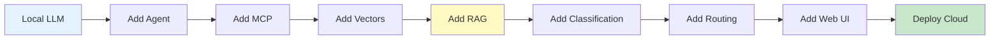

# Architecture Quick Reference Card

## At-a-Glance: All Labs

### Lab 1: Local LLM Basics
```
User → Ollama (:11434) → llama3.2 → Response
```
**Use for slides:** Simple introduction to local inference

---

### Lab 2: Simple Agent (TAO)
```
Query → LLM (Thought) → Tool (Action) → Data (Observation) → Response
```
**Use for slides:** Agent decision-making introduction

---

### Lab 3: MCP Protocol
```
Agent → MCP Client → HTTP → MCP Server (:8000) → Tools → API
```
**Use for slides:** Separation of concerns, protocol standardization

---

### Lab 4: Vector Databases
```
Documents → Embed → ChromaDB → Query → Embed → Search → Top-K Results
```
**Use for slides:** Semantic search introduction

---

### Lab 5: RAG + Agent
```
Query → RAG (Vector Search) → Context → Agent → MCP Tools → LLM → Rich Response
```
**Use for slides:** Knowledge-grounded generation

---

### Lab 6: Classification Server
```
Natural Language → LLM Classify → Canonical Query → Execute → Structured Result
```
**Use for slides:** Intent classification, server intelligence

---

### Lab 7: Dual-Workflow Agent
```
Query → Router → {Data: Classification | Weather: RAG} → MCP → Response
```
**Use for slides:** Intelligent routing, multi-domain

---

### Lab 8: Web UI + Memory
```
Browser → Streamlit (:8501) → Agent → [Session Memory Dashboard] → Response
```
**Use for slides:** Production-ready interface

---

### Lab 9: Cloud Deployment
```
Internet → Hugging Face Space → Streamlit → Embedded Agent → Ollama (1B) → Response
```
**Use for slides:** Cloud deployment, resource optimization

---

## Presentation Slide Recommendations

### For Introduction (All Labs Overview)


### For Each Lab
Use the "Presentation Slide Diagram (Simple)" from each architecture-labN.md file

---

## Key Teaching Moments

### Lab 1
**Concept:** Local vs Cloud LLMs
**Diagram:** Ollama architecture
**Time:** 5 min

### Lab 2
**Concept:** Agents make decisions
**Diagram:** TAO loop sequence
**Time:** 10 min

### Lab 2.5 (Optional)
**Concept:** Memory enables multi-turn conversations
**Diagram:** Memory buffer workflow
**Time:** 5 min

### Lab 3
**Concept:** Protocols enable separation
**Diagram:** MCP client-server
**Time:** 10 min

### Lab 4
**Concept:** Vectors capture meaning
**Diagram:** Embedding → Vector space → Search
**Time:** 15 min

### Lab 5
**Concept:** RAG grounds LLM responses
**Diagram:** RAG pipeline with agent
**Time:** 15 min

### Lab 6
**Concept:** Classification structures unstructured input
**Diagram:** Natural language → Canonical → Execute
**Time:** 10 min

### Lab 7
**Concept:** Routing optimizes workflows
**Diagram:** Router decision tree
**Time:** 10 min

### Lab 8
**Concept:** UI makes AI accessible
**Diagram:** Web stack with memory dashboard
**Time:** 10 min

### Lab 9
**Concept:** Cloud deployment trade-offs
**Diagram:** Local vs Cloud architecture comparison
**Time:** 15 min

---

## Component Legend

### Colors in Diagrams
- **Blue** (#e1f5ff): LLM/AI Components
- **Yellow** (#fff4e1): Data Storage/Databases
- **Green** (#e8f5e9): Processing/Computation
- **Red** (#ffe8e8): User Input/Output
- **Purple** (#f3e5f5): Network/Communication

### Common Icons
- **[Agent]**: Intelligent decision-making component
- **(User)**: Human interaction point
- **:PORT**: Network service with port number
- **@tool**: MCP tool decorator
- **{Router}**: Decision/branching point
- **[(Database)]**: Data storage

---

## Progressive Complexity Chart

```
Complexity ↑
    │
    │                                                    ╔══ Lab 9
    │                                            ╔══ Lab 8
    │                                    ╔══ Lab 7
    │                        ╔══ Lab 6   ║
    │                ╔══ Lab 5           ║
    │                ║                   ║
    │        ╔══ Lab 3                   ║
    │    Lab 4       ║                   ║
    │    ║           ║                   ║
    │    ║   Lab 2   ║                   ║
    │    ║   Lab 2.5 ║                   ║
    │    ║   ║       ║                   ║
    │Lab 1   ║       ║                   ║
    └────────────────────────────────────────→ Features
```

---

## Minimum Viable Slides Per Lab

### Lab 1 (3 slides)
1. Title: "Running LLMs Locally with Ollama"
2. Architecture: Simple Ollama diagram
3. Demo: CLI vs API interaction

### Lab 2 (4 slides)
1. Title: "Agentic Behavior & Tool Calling"
2. Concept: What is an agent?
3. Architecture: TAO loop diagram
4. Demo: Weather agent in action

### Lab 3 (4 slides)
1. Title: "Model Context Protocol (MCP)"
2. Problem: Why protocols matter
3. Architecture: Client-server diagram
4. Benefits: Separation of concerns

### Lab 4 (5 slides)
1. Title: "Vector Databases & Semantic Search"
2. Concept: What are vectors?
3. Architecture: Embedding → DB → Search
4. Demo: Keyword vs semantic search comparison
5. Foundation: Sets up RAG

### Lab 5 (5 slides)
1. Title: "RAG: Retrieval-Augmented Generation"
2. Architecture: RAG pipeline diagram
3. Flow: Retrieve → Augment → Generate
4. Memory Enhancement: Vector-based memory
5. Demo: Grounded responses

### Lab 6 (4 slides)
1. Title: "Classification for Structured Queries"
2. Architecture: Classification server diagram
3. Concept: Canonical queries
4. Benefits: Consistency + extensibility

### Lab 7 (4 slides)
1. Title: "Intelligent Multi-Workflow Routing"
2. Architecture: Dual-workflow diagram
3. Routing: Intent detection logic
4. Demo: Different queries, different workflows

### Lab 8 (4 slides)
1. Title: "Production-Ready Web Interface"
2. Architecture: Streamlit stack
3. Feature: Memory dashboard showcase
4. Demo: Live UI interaction

### Lab 9 (4 slides)
1. Title: "Cloud Deployment"
2. Comparison: Local vs Cloud architecture
3. Optimizations: Resource constraints
4. Result: Public URL demo

**Total Minimum:** 40 slides for full course

---

## Common Questions & Diagram Answers

**Q: "Why use MCP instead of direct function calls?"**
→ Show Lab 3 architecture comparison diagram

**Q: "What's the difference between keyword and semantic search?"**
→ Show Lab 4 comparison diagram

**Q: "How does RAG prevent hallucinations?"**
→ Show Lab 5 RAG pipeline with grounding step

**Q: "Why do we need multiple workflows?"**
→ Show Lab 7 routing decision tree

**Q: "How does memory work?"**
→ Show Lab 2.5 buffer OR Lab 5 vector memory diagram

---

## File Locations

All architecture diagrams are in: `/docs/`

- `architecture-lab1.md` through `architecture-lab9.md`
- `architecture-index.md` - Full index with summaries
- `architecture-quick-reference.md` - This file

Each file contains:
1. Detailed architecture diagram (for deep-dive)
2. Simple presentation diagram (for slides)
3. Component details
4. Data flows
5. Code snippets
6. Key learning points

---

## Tips for Presentations

1. **Start Simple**: Use presentation diagrams, not detailed ones
2. **Build Progressively**: Show components one at a time
3. **Use Colors Consistently**: Same color = same concept across labs
4. **Live Demos**: Diagrams explain architecture, demos show it working
5. **Reference Back**: Connect Lab N to concepts from Lab N-1

---

**Quick Export**: All Mermaid diagrams can be exported to PNG/SVG using:
- GitHub (automatic rendering)
- VS Code Mermaid extension
- mermaid.live (online editor)
- mermaid-cli (`mmdc -i input.md -o output.png`)

---

**For training purposes only. (C) 2025 Tech Skills Transformations and Brent C. Laster - all rights reserved.**
